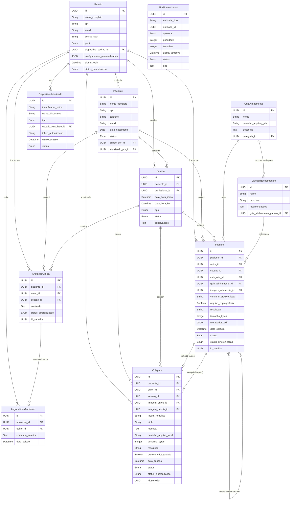
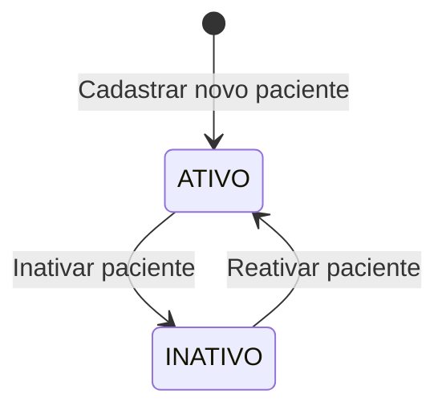
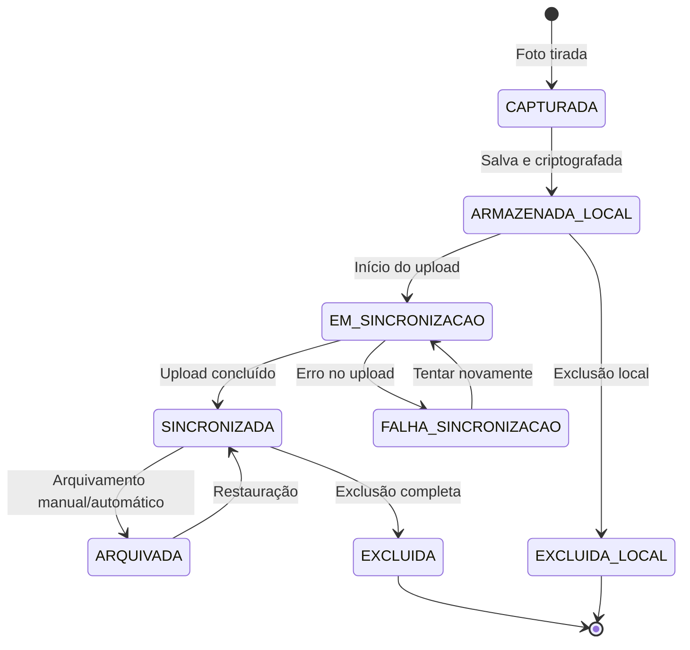
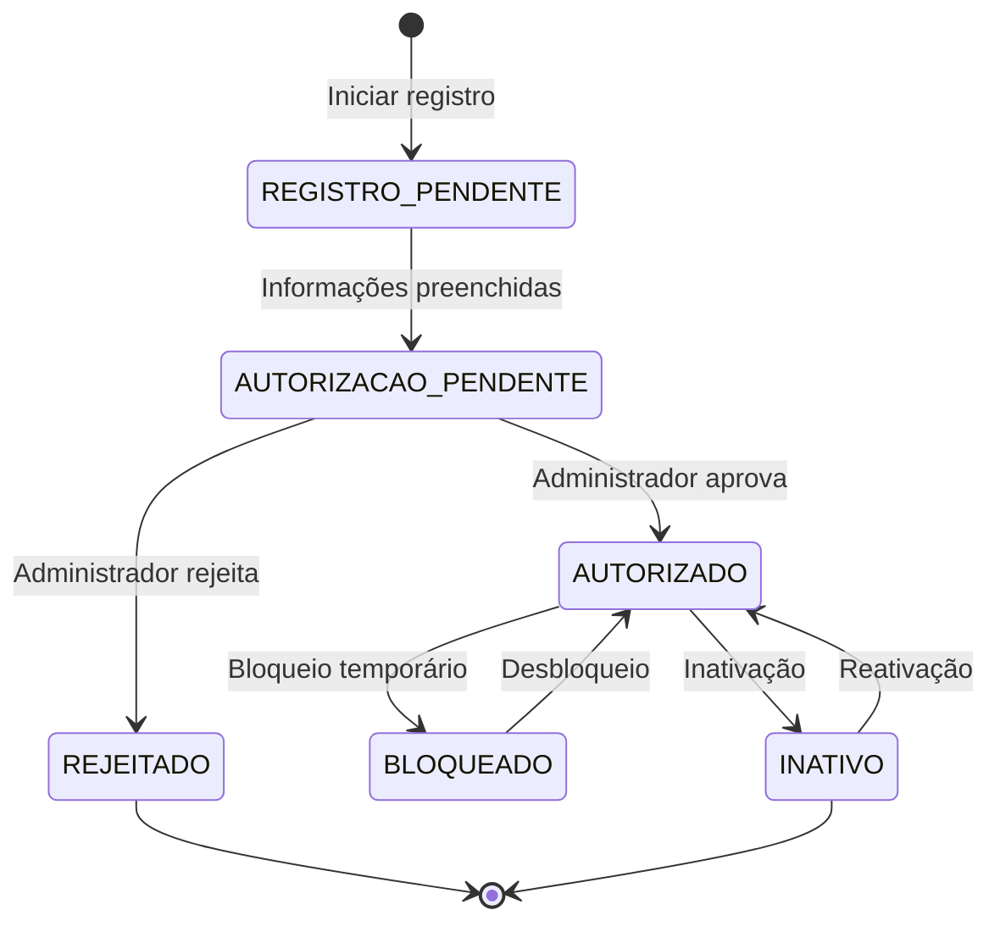
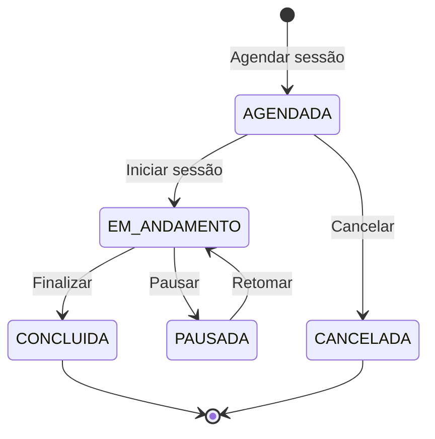
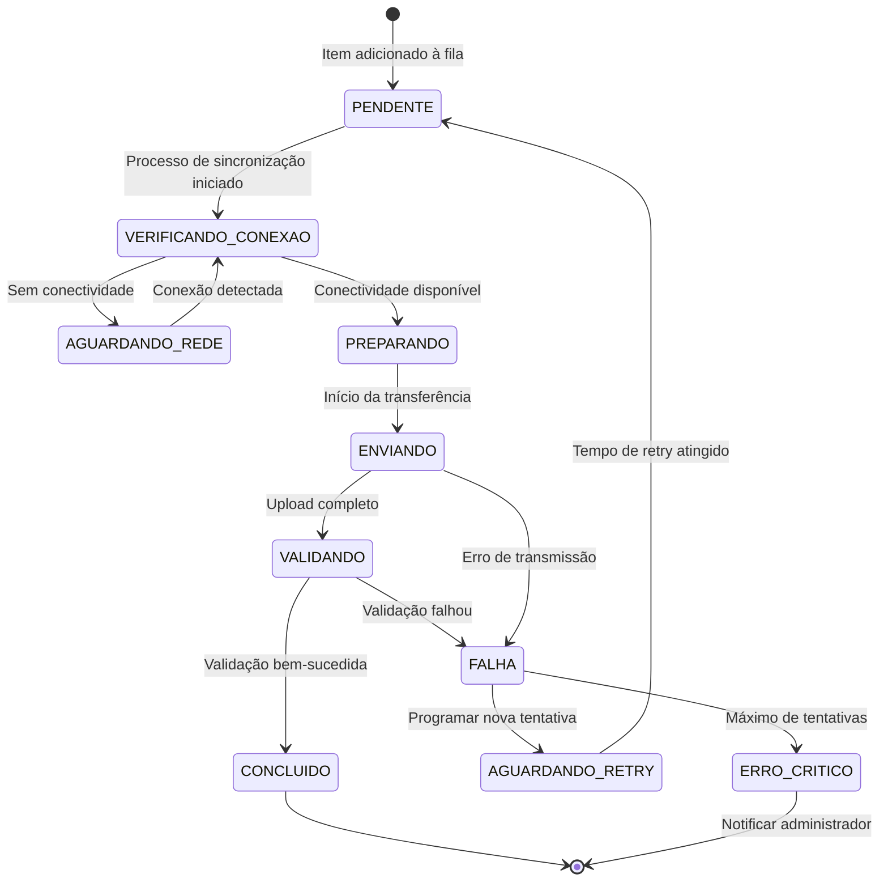

# Modelo de Dados Consolidado e Máquinas de Estado

## 1. Visão Geral

Este documento representa o modelo de dados unificado do sistema FotoClinic, derivado da análise aprofundada de todas as
Histórias de Usuário e Documentos de Requisitos. Ele descreve as entidades, seus atributos, relacionamentos e os ciclos
de vida (máquinas de estado) das entidades dinâmicas.

O modelo foi construído para suportar todas as funcionalidades do sistema, incluindo:

- Gestão de usuários e pacientes
- Captura e processamento de imagens
- Prontuários e anotações clínicas
- Sincronização e armazenamento seguro
- Fluxo de trabalho completo da clínica

## 2. Detalhamento das Entidades

Abaixo estão detalhadas todas as entidades do sistema.

### 2.1. Usuario

Representa os operadores do sistema com diferentes níveis de permissão.

| Atributo                       | Tipo     | Descrição                                                                | Chave  | Exemplo                                |
|--------------------------------|----------|--------------------------------------------------------------------------|--------|----------------------------------------|
| `id`                           | UUID     | Identificador único do usuário                                           | PK     | `uuid()`                               |
| `nome_completo`                | String   | Nome do usuário                                                          |        | `"Dra. Ana Sousa"`                     |
| `cpf`                          | String   | CPF do usuário (único)                                                   | Unique | `"123.456.789-00"`                     |
| `email`                        | String   | E-mail de login (único)                                                  | Unique | `"ana.sousa@clinic.com"`               |
| `senha_hash`                   | String   | Hash da senha do usuário                                                 |        | `bcrypt_hash(...)`                     |
| `perfil`                       | Enum     | Nível de acesso (`RECEPCIONISTA`, `PROFISSIONAL_SAUDE`, `ADMINISTRADOR`) |        | `PROFISSIONAL_SAUDE`                   |
| `dispositivo_padrao_id`        | UUID     | Dispositivo normalmente utilizado                                        | FK     | `uuid()`                               |
| `configuracoes_personalizadas` | JSON     | Preferências de interface e trabalho                                     |        | `{"tema":"claro","notificacoes":true}` |
| `ultimo_login`                 | Datetime | Data e hora do último acesso                                             |        | `2025-08-08T15:30:42`                  |
| `status_autenticacao`          | Enum     | Status (`ATIVO`, `BLOQUEADO`, `INATIVO`)                                 |        | `ATIVO`                                |
| `criado_em`                    | Datetime | Data de criação do registro                                              |        | `now()`                                |
| `atualizado_em`                | Datetime | Data da última atualização                                               |        | `now()`                                |

### 2.2. Paciente

A entidade central do sistema, contendo informações demográficas e de status.

| Atributo            | Tipo     | Descrição                                          | Chave    | Exemplo                |
|---------------------|----------|----------------------------------------------------|----------|------------------------|
| `id`                | UUID     | Identificador único do paciente                    | PK       | `uuid()`               |
| `nome_completo`     | String   | Nome completo do paciente                          |          | `"Carlos Pereira"`     |
| `cpf`               | String   | CPF do paciente (único)                            | Unique   | `"987.654.321-00"`     |
| `telefone`          | String   | Telefone de contato                                |          | `"(11) 98765-4321"`    |
| `email`             | String   | E-mail de contato                                  | Opcional | `"carlos.p@email.com"` |
| `data_nascimento`   | Date     | Data de nascimento do paciente                     |          | `1985-05-20`           |
| `status`            | Enum     | Status do paciente no sistema (`ATIVO`, `INATIVO`) |          | `ATIVO`                |
| `criado_por_id`     | UUID     | Chave estrangeira para `Usuario` (quem cadastrou)  | FK       | `uuid()`               |
| `atualizado_por_id` | UUID     | Chave estrangeira para `Usuario` (última edição)   | FK       | `uuid()`               |
| `criado_em`         | Datetime | Data de criação do registro                        |          | `now()`                |
| `atualizado_em`     | Datetime | Data da última atualização                         |          | `now()`                |

### 2.3. AnotacaoClinica

Registros textuais feitos pelos profissionais de saúde no prontuário do paciente.

| Atributo               | Tipo     | Descrição                                        | Chave    | Exemplo                        |
|------------------------|----------|--------------------------------------------------|----------|--------------------------------|
| `id`                   | UUID     | Identificador único da anotação                  | PK       | `uuid()`                       |
| `paciente_id`          | UUID     | Chave estrangeira para `Paciente`                | FK       | `uuid()`                       |
| `autor_id`             | UUID     | Chave estrangeira para `Usuario` (quem escreveu) | FK       | `uuid()`                       |
| `conteudo`             | Text     | O texto da anotação clínica                      |          | `"Paciente relata melhora..."` |
| `status_sincronizacao` | Enum     | Status da sincronização com o servidor           |          | `PENDENTE`                     |
| `id_servidor`          | UUID     | ID do registro no servidor central               | Opcional | `uuid()`                       |
| `criado_em`            | Datetime | Data de criação do registro                      |          | `now()`                        |
| `atualizado_em`        | Datetime | Data da última atualização                       |          | `now()`                        |

### 2.4. LogAuditoriaAnotacao

Armazena o histórico de edições de uma `AnotacaoClinica` para garantir rastreabilidade.

| Atributo            | Tipo     | Descrição                                      | Chave | Exemplo                |
|---------------------|----------|------------------------------------------------|-------|------------------------|
| `id`                | UUID     | Identificador único do log                     | PK    | `uuid()`               |
| `anotacao_id`       | UUID     | Chave estrangeira para `AnotacaoClinica`       | FK    | `uuid()`               |
| `editor_id`         | UUID     | Chave estrangeira para `Usuario` (quem editou) | FK    | `uuid()`               |
| `conteudo_anterior` | Text     | O conteúdo da anotação antes da edição         |       | `"Paciente relata..."` |
| `data_edicao`       | Datetime | Data em que a edição foi realizada             |       | `now()`                |

### 2.5. Imagem

Representa uma fotografia individual capturada pelo aplicativo.

| Atributo                | Tipo     | Descrição                                        | Chave        | Exemplo                              |
|-------------------------|----------|--------------------------------------------------|--------------|--------------------------------------|
| `id`                    | UUID     | Identificador único da imagem                    | PK           | `uuid()`                             |
| `paciente_id`           | UUID     | Chave estrangeira para `Paciente`                | FK           | `uuid()`                             |
| `autor_id`              | UUID     | Chave estrangeira para `Usuario` (quem capturou) | FK           | `uuid()`                             |
| `sessao_id`             | UUID     | Sessão/consulta vinculada                        | Opcional, FK | `uuid()`                             |
| `categoria_id`          | UUID     | Categoria da imagem                              | Opcional, FK | `uuid()`                             |
| `guia_alinhamento_id`   | UUID     | Chave estrangeira para `GuiaAlinhamento`         | Opcional, FK | `uuid()`                             |
| `imagem_referencia_id`  | UUID     | Chave para `Imagem` (Modo Fantasma)              | Opcional, FK | `uuid()`                             |
| `caminho_arquivo_local` | String   | Path para o arquivo no armazenamento privado     |              | `/data/files/img_123.jpg`            |
| `arquivo_criptografado` | Boolean  | Flag que indica se o arquivo está criptografado  |              | `true`                               |
| `resolucao`             | String   | Resolução da imagem em pixels                    |              | `"3024x4032"`                        |
| `tamanho_bytes`         | Integer  | Tamanho do arquivo em bytes                      |              | `2457600`                            |
| `metadados_exif`        | JSON     | Metadados técnicos da captura                    |              | `{"camera":"iPhone 12","iso":"100"}` |
| `data_captura`          | Datetime | Data e hora exatas da captura                    |              | `now()`                              |
| `status`                | Enum     | Estado atual da imagem no fluxo                  |              | `ARMAZENADA_LOCAL`                   |
| `status_sincronizacao`  | Enum     | Status da sincronização com o servidor           |              | `PENDENTE`                           |
| `id_servidor`           | UUID     | ID do registro no servidor central               | Opcional     | `uuid()`                             |

### 2.6. Colagem

Representa uma imagem composta (antes e depois) criada a partir de duas `Imagem` existentes.

| Atributo                | Tipo     | Descrição                                       | Chave        | Exemplo                         |
|-------------------------|----------|-------------------------------------------------|--------------|---------------------------------|
| `id`                    | UUID     | Identificador único da colagem                  | PK           | `uuid()`                        |
| `paciente_id`           | UUID     | Chave estrangeira para `Paciente`               | FK           | `uuid()`                        |
| `autor_id`              | UUID     | Chave estrangeira para `Usuario` (quem criou)   | FK           | `uuid()`                        |
| `sessao_id`             | UUID     | Sessão/consulta vinculada                       | Opcional, FK | `uuid()`                        |
| `imagem_antes_id`       | UUID     | Chave estrangeira para a `Imagem` de "antes"    | FK           | `uuid()`                        |
| `imagem_depois_id`      | UUID     | Chave estrangeira para a `Imagem` de "depois"   | FK           | `uuid()`                        |
| `layout_template`       | String   | Identificador do template de layout utilizado   |              | `"ANTES_DEPOIS_HORIZONTAL"`     |
| `titulo`                | String   | Título opcional da colagem                      | Opcional     | `"Evolução Tratamento"`         |
| `legenda`               | Text     | Legenda ou descrição da colagem                 | Opcional     | `"Comparativo antes/depois..."` |
| `caminho_arquivo_local` | String   | Path para o arquivo da colagem gerada           |              | `/data/files/col_456.jpg`       |
| `tamanho_bytes`         | Integer  | Tamanho do arquivo em bytes                     |              | `3457600`                       |
| `resolucao`             | String   | Resolução da colagem                            |              | `"3000x1500"`                   |
| `arquivo_criptografado` | Boolean  | Flag que indica se o arquivo está criptografado |              | `true`                          |
| `data_criacao`          | Datetime | Data e hora da criação da colagem               |              | `now()`                         |
| `status`                | Enum     | Estado atual da colagem no fluxo                |              | `ARMAZENADA_LOCAL`              |
| `status_sincronizacao`  | Enum     | Status da sincronização com o servidor          |              | `PENDENTE`                      |
| `id_servidor`           | UUID     | ID do registro no servidor central              | Opcional     | `uuid()`                        |

### 2.7. GuiaAlinhamento

Armazena as molduras (overlays) usadas para padronizar a captura de fotos.

| Atributo               | Tipo   | Descrição                             | Chave    | Exemplo                            |
|------------------------|--------|---------------------------------------|----------|------------------------------------|
| `id`                   | UUID   | Identificador único da guia           | PK       | `uuid()`                           |
| `nome`                 | String | Nome da guia (ex: "Face Frontal")     |          | `"Face Frontal"`                   |
| `caminho_arquivo_guia` | String | Path para o arquivo de imagem da guia |          | `/assets/guias/face.png`           |
| `descricao`            | Text   | Instruções para uso da guia           | Opcional | `"Alinhe os olhos com a linha..."` |
| `categoria_id`         | UUID   | Categoria de imagens associada        | FK       | `uuid()`                           |

### 2.8. Sessao

Representa um atendimento ou consulta específica do paciente.

| Atributo           | Tipo     | Descrição                                                     | Chave    | Exemplo                         |
|--------------------|----------|---------------------------------------------------------------|----------|---------------------------------|
| `id`               | UUID     | Identificador único da sessão                                 | PK       | `uuid()`                        |
| `paciente_id`      | UUID     | Paciente vinculado à sessão                                   | FK       | `uuid()`                        |
| `profissional_id`  | UUID     | Profissional responsável                                      | FK       | `uuid()`                        |
| `data_hora_inicio` | Datetime | Momento de início da sessão                                   |          | `2025-08-08T14:30:00`           |
| `data_hora_fim`    | Datetime | Momento de término                                            | Opcional | `2025-08-08T15:15:00`           |
| `tipo`             | Enum     | Tipo da sessão (`INICIAL`, `RETORNO`, `AVALIACAO`)            |          | `RETORNO`                       |
| `status`           | Enum     | Status (`AGENDADA`, `EM_ANDAMENTO`, `CONCLUIDA`, `CANCELADA`) |          | `CONCLUIDA`                     |
| `observacoes`      | Text     | Anotações gerais sobre a sessão                               | Opcional | `"Paciente relatou melhora..."` |
| `criado_em`        | Datetime | Data de criação do registro                                   |          | `now()`                         |
| `atualizado_em`    | Datetime | Data da última atualização                                    |          | `now()`                         |

### 2.9. DispositivoAutorizado

Registra os dispositivos que têm permissão para acessar o sistema.

| Atributo               | Tipo     | Descrição                                               | Chave        | Exemplo                |
|------------------------|----------|---------------------------------------------------------|--------------|------------------------|
| `id`                   | UUID     | Identificador único do dispositivo                      | PK           | `uuid()`               |
| `identificador_unico`  | String   | ID de hardware ou software do dispositivo               | Unique       | `"B1AC53D2F7"`         |
| `nome_dispositivo`     | String   | Nome amigável do dispositivo                            |              | `"iPad Consultório 2"` |
| `tipo`                 | Enum     | Tipo do dispositivo (`TABLET`, `DESKTOP`, `SMARTPHONE`) |              | `TABLET`               |
| `usuario_vinculado_id` | UUID     | Usuário normalmente associado                           | Opcional, FK | `uuid()`               |
| `token_autenticacao`   | String   | Token de acesso autorizado                              |              | `hash(...)`            |
| `ultimo_acesso`        | Datetime | Data/hora do último acesso                              | Opcional     | `now()`                |
| `status`               | Enum     | Status (`ATIVO`, `INATIVO`, `BLOQUEADO`)                |              | `ATIVO`                |
| `criado_em`            | Datetime | Data de criação do registro                             |              | `now()`                |
| `atualizado_em`        | Datetime | Data da última atualização                              |              | `now()`                |

### 2.10. CategorizacaoImagem

Define categorias para organizar e padronizar os tipos de fotografia.

| Atributo                     | Tipo     | Descrição                            | Chave        | Exemplo                              |
|------------------------------|----------|--------------------------------------|--------------|--------------------------------------|
| `id`                         | UUID     | Identificador único da categoria     | PK           | `uuid()`                             |
| `nome`                       | String   | Nome da categoria de foto            |              | `"Face Frontal"`                     |
| `descricao`                  | String   | Descrição da categoria               |              | `"Fotografia frontal do rosto"`      |
| `recomendacoes`              | Text     | Recomendações de captura             | Opcional     | `"Luz frontal, expressão neutra..."` |
| `guia_alinhamento_padrao_id` | UUID     | Guia recomendado para esta categoria | Opcional, FK | `uuid()`                             |
| `criado_em`                  | Datetime | Data de criação do registro          |              | `now()`                              |
| `atualizado_em`              | Datetime | Data da última atualização           |              | `now()`                              |

### 2.11. FilaSincronizacao

Controla a fila de itens para sincronização entre dispositivo local e servidor.

| Atributo           | Tipo     | Descrição                                              | Chave    | Exemplo                |
|--------------------|----------|--------------------------------------------------------|----------|------------------------|
| `id`               | UUID     | Identificador único do item na fila                    | PK       | `uuid()`               |
| `entidade_tipo`    | String   | Tipo da entidade a ser sincronizada                    |          | `"Imagem"`             |
| `entidade_id`      | UUID     | ID da entidade a sincronizar                           |          | `uuid()`               |
| `operacao`         | Enum     | Operação (`CREATE`, `UPDATE`, `DELETE`)                |          | `CREATE`               |
| `prioridade`       | Integer  | Nível de prioridade                                    |          | `1`                    |
| `tentativas`       | Integer  | Número de tentativas realizadas                        |          | `2`                    |
| `ultima_tentativa` | Datetime | Momento da última tentativa                            | Opcional | `2025-08-08T15:45:32`  |
| `status`           | Enum     | Status (`PENDENTE`, `PROCESSANDO`, `SUCESSO`, `FALHA`) |          | `PENDENTE`             |
| `erro`             | Text     | Detalhes do último erro                                | Opcional | `"Timeout na conexão"` |
| `criado_em`        | Datetime | Data de criação do registro                            |          | `now()`                |
| `atualizado_em`    | Datetime | Data da última atualização                             |          | `now()`                |

## 3. Diagrama Entidade-Relacionamento (ERD)

## 4. Máquinas de Estado

### 4.1. Máquina de Estado do Paciente

Define o ciclo de vida de um paciente no sistema, que pode ser ativado ou inativado.

### 4.2. Ciclo de Vida da Imagem (Expandido)

### 4.3. Ciclo de Vida do Dispositivo Autorizado

### 4.4. Máquina de Estado da Sessão/Consulta

### 4.5. Máquina de Estado de Sincronização (Detalhada)

