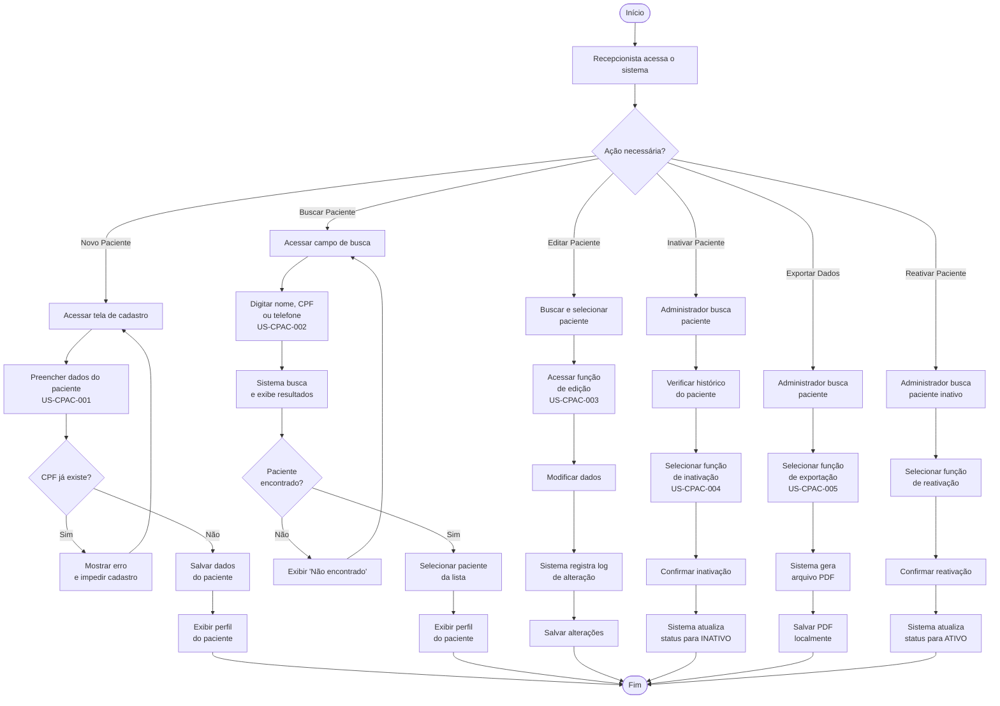
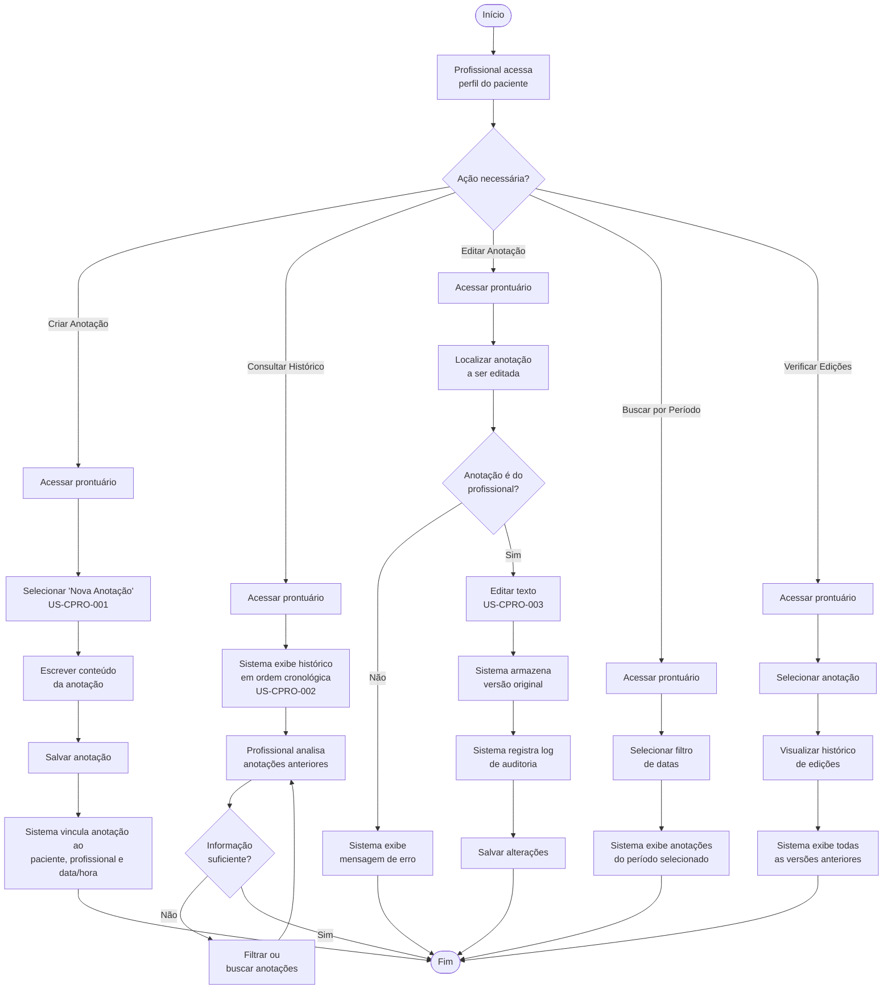
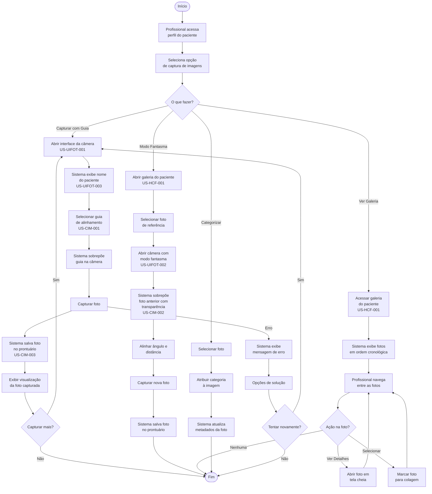
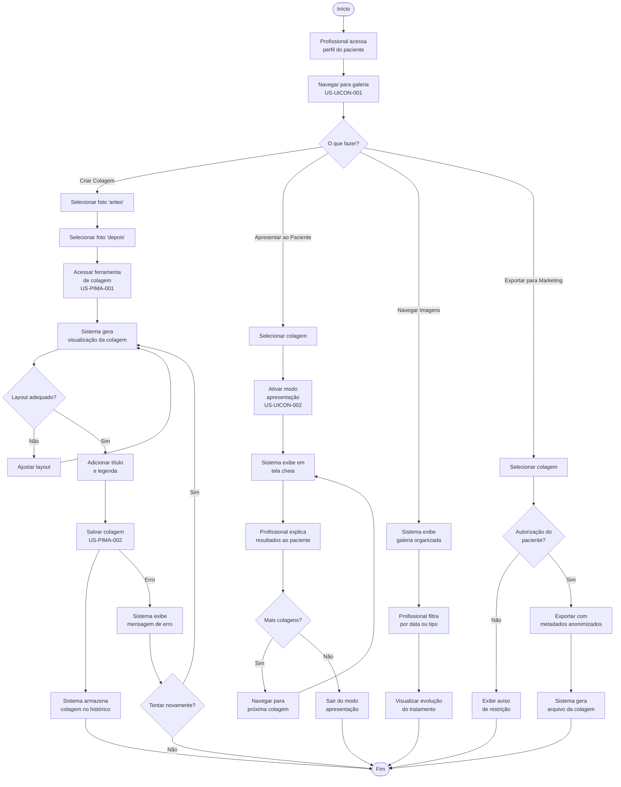
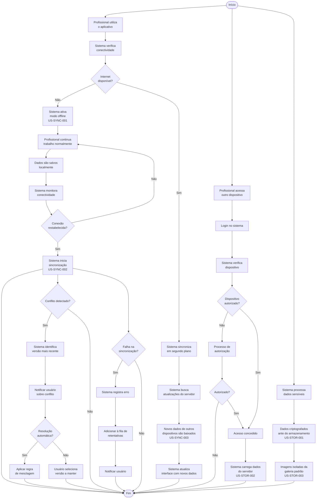
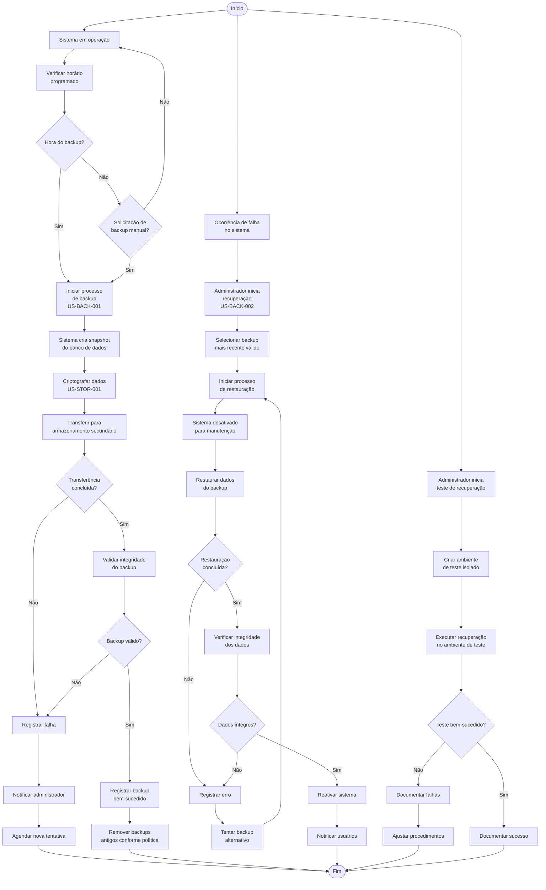
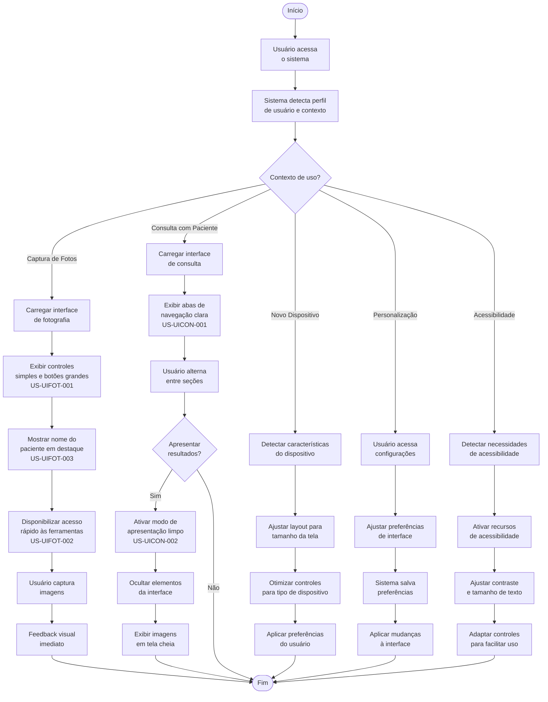
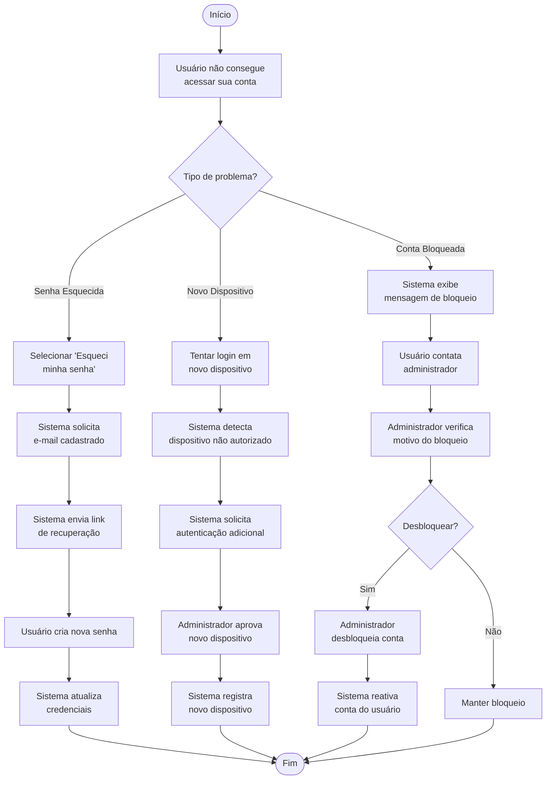
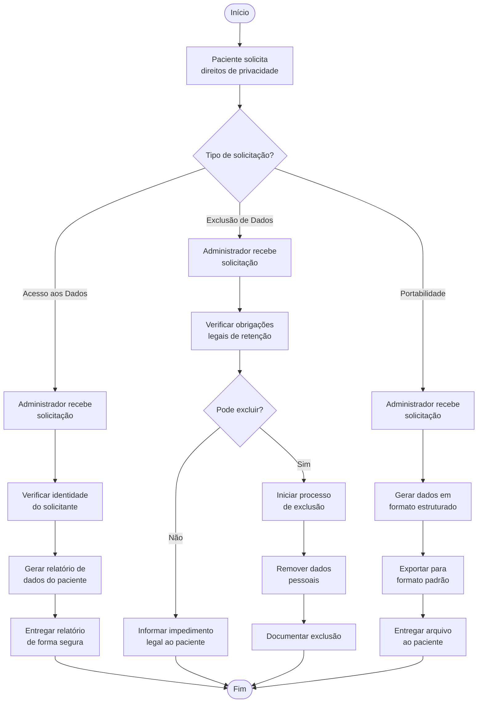

# Diagramas de Atividade das Jornadas do Usuário - PhotoClinic

Este documento complementa o arquivo de jornadas do usuário, apresentando diagramas de atividade detalhados para cada jornada, incluindo fluxos principais, edge-cases e sugestões de melhorias.

---

## 1. Jornada de Cadastro e Gestão de Pacientes

---

## 2. Jornada de Documentação Clínica

---

## 3. Jornada de Captura e Organização de Imagens

---

## 4. Jornada de Processamento e Apresentação de Resultados

---

## 5. Jornada de Sincronização e Disponibilidade de Dados

---

## 6. Jornada de Segurança e Recuperação de Dados

---

## 7. Jornada de Experiência do Usuário Otimizada

---

## Casos de Uso Adicionais

### Recuperação de Conta e Dispositivo

### Jornada de Conformidade com a LGPD

