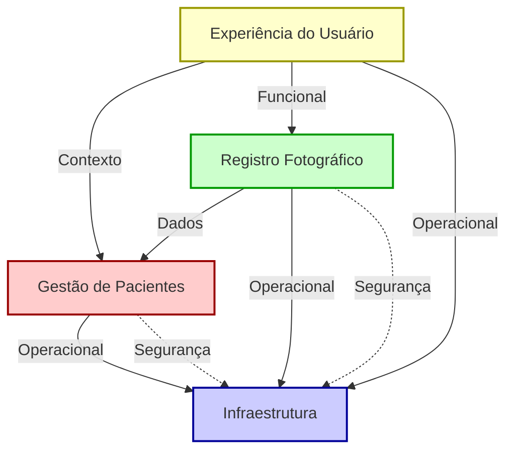

# Domínios do Sistema PhotoClinic

Este documento detalha cada domínio do sistema PhotoClinic, sua função, os módulos incluídos, e apresenta uma análise aprofundada das dependências entre eles, com um diagrama ilustrando essas relações.

---

## 1. Domínio de Gestão de Pacientes

**Objetivo:** Gerenciar os dados e registros de todos os pacientes da clínica.

**Módulos:**
- Cadastro de Paciente (CPAC): Registro, edição e consulta dos dados dos pacientes.
- Gestão de Prontuários (CPRO): Centraliza informações clínicas não-fotográficas.

**Contexto:**
Este domínio é a base fundamental do sistema, pois todos os registros fotográficos, consultas e operações dependem da existência e identificação correta dos pacientes. Implementa regras de negócio específicas para a gestão clínica dos pacientes.

**Fornece para outros domínios:**
- Identificação única de pacientes
- Contexto clínico textual (prontuários)
- Dados demográficos para categorização

---

## 2. Domínio de Registro Fotográfico

**Objetivo:** Gerenciar todo o ciclo de vida das fotografias clínicas.

**Módulos:**
- Histórico Clínico Fotográfico (HCF): Gerencia imagens dos pacientes.
- Captura de Imagens (CIM): Interface de captura com molduras e modo fantasma.
- Processamento de Imagens (PIMA): Criação de colagens, ajustes e comparativos visuais.

**Contexto:**
Responsável pelo core de valor do sistema - registro, organização e processamento das imagens clínicas. Central para o valor clínico e comercial do aplicativo.

**Fornece para outros domínios:**
- Imagens clínicas processadas e organizadas
- Metadados visuais para diagnósticos
- Recursos para apresentação e comparação

---

## 3. Domínio de Infraestrutura

**Objetivo:** Fornecer serviços de base para a aplicação.

**Módulos:**
- Sincronização (SYNC): Mantém dados sincronizados entre dispositivos.
- Armazenamento (STOR): Gerenciamento seguro de imagens e dados em nuvem.
- Backup e Recuperação (BACK): Segurança e disponibilidade dos dados.

**Contexto:**
Implementa serviços fundamentais que garantem o funcionamento confiável e seguro de todos os outros domínios. Define padrões técnicos e requisitos não funcionais do sistema.

**Fornece para outros domínios:**
- Persistência segura de dados
- Disponibilidade em múltiplos dispositivos
- Continuidade operacional e recuperação de falhas

---

## 4. Domínio de Experiência do Usuário

**Objetivo:** Fornecer interfaces e fluxos otimizados para diferentes perfis de usuários.

**Módulos:**
- Interface de Fotografia (UIFOT): Otimizada para captura de imagens.
- Interface de Consulta (UICON): Dedicada à visualização e análise durante o atendimento.

**Contexto:**
Traduz as funcionalidades dos outros domínios em experiências coerentes e eficientes para o usuário final, considerando os diferentes cenários de uso no ambiente clínico.

**Fornece para outros domínios:**
- Entrada de dados contextualizada
- Feedback visual das operações do sistema
- Controles de interação adaptados ao contexto clínico

---

## Análise de Dependências entre Domínios

### Tipos de Dependências

No sistema PhotoClinic, identificamos cinco tipos principais de dependências entre os domínios:

1. **Dependências de Dados:** Um domínio necessita dos dados geridos por outro domínio.
2. **Dependências Funcionais:** Um domínio utiliza serviços ou funcionalidades implementados por outro domínio.
3. **Dependências Contextuais:** Um domínio precisa do contexto estabelecido por outro domínio para operar adequadamente.
4. **Dependências Operacionais:** Um domínio depende de outro para garantir a operação consistente do sistema.
5. **Dependências de Registro:** Um domínio envia informações de log e auditoria para outro domínio.

### Mapeamento das Dependências

#### Dependências do Domínio de Gestão de Pacientes

- **→ Infraestrutura:**
  - Dependência funcional e operacional para persistência de dados de pacientes (STOR)
  - Dependência operacional para sincronização entre dispositivos (SYNC)
  - Dependência de segurança para proteção de dados sensíveis de saúde (STOR, BACK)

#### Dependências do Domínio de Registro Fotográfico

- **→ Gestão de Pacientes:**
  - Dependência de dados para associar imagens a um paciente específico (CPAC)
  - Dependência contextual para vincular imagens ao histórico clínico do paciente (CPRO)
  
- **→ Infraestrutura:**
  - Dependência funcional para armazenamento seguro de imagens de alta resolução (STOR)
  - Dependência operacional para sincronização de imagens entre dispositivos (SYNC)
  - Dependência de segurança para garantir o backup e recuperação das imagens (BACK)

#### Dependências do Domínio de Experiência do Usuário

- **→ Gestão de Pacientes:**
  - Dependência de dados para exibir informações do paciente na interface (CPAC)
  - Dependência contextual para mostrar o histórico de prontuário durante consultas (CPRO)
  
- **→ Registro Fotográfico:**
  - Dependência funcional para captura de novas imagens (CIM)
  - Dependência de dados para exibição do histórico fotográfico (HCF)
  - Dependência funcional para processamento e comparação de imagens (PIMA)
  
- **→ Infraestrutura:**
  - Dependência operacional para sincronização de dados da interface (SYNC)
  - Dependência funcional para acessar dados armazenados (STOR)

#### Dependências do Domínio de Infraestrutura

- **Nenhuma dependência direta** dos outros domínios, sendo este o domínio mais fundamental do ponto de vista arquitetural.
- Entretanto, o domínio de Infraestrutura utiliza metadados e contextos dos outros domínios para otimizar operações de sincronização, armazenamento e backup.

---

## Diagrama de Dependências entre Domínios

### Legenda do Diagrama

- **Gestão de Pacientes (PAC):** Domínio fundamental de dados
- **Registro Fotográfico (REG):** Domínio core de valor
- **Infraestrutura (INF):** Domínio técnico de suporte
- **Experiência do Usuário (UI):** Domínio de interação

---

## Impacto das Dependências na Arquitetura

A análise de dependências revela uma arquitetura em camadas com considerações importantes:

1. **Modificabilidade:** Alterações no Domínio de Infraestrutura têm alto impacto sistêmico, enquanto mudanças na Experiência do Usuário têm impacto localizado.

2. **Testabilidade:** O Domínio de Gestão de Pacientes pode ser testado com maior independência, enquanto o Domínio de Experiência do Usuário requer maior integração para testes efetivos.

3. **Escalabilidade:** O Domínio de Infraestrutura deve ser projetado com maior capacidade de escala, pois suporta os requisitos de desempenho de todos os outros domínios.

4. **Segurança:** Os dados sensíveis do paciente transitam por todos os domínios, exigindo uma abordagem de segurança holística, mas com foco especial nas dependências entre Gestão de Pacientes e Infraestrutura.

Esta análise de dependências orienta decisões arquiteturais e de desenvolvimento, garantindo que as interfaces entre domínios sejam bem definidas e que cada domínio respeite seu escopo e responsabilidade.

---

## Resumo

- Cada domínio é composto por módulos especializados.
- A base de tudo é a gestão de pacientes.
- O registro fotográfico depende dos pacientes.
- A infraestrutura é transversal e sustenta todos os domínios.
- A experiência do usuário é a camada visível, que depende de todos os demais.

Se precisar de detalhamento de cada módulo ou de diagramas por módulo, basta solicitar.
