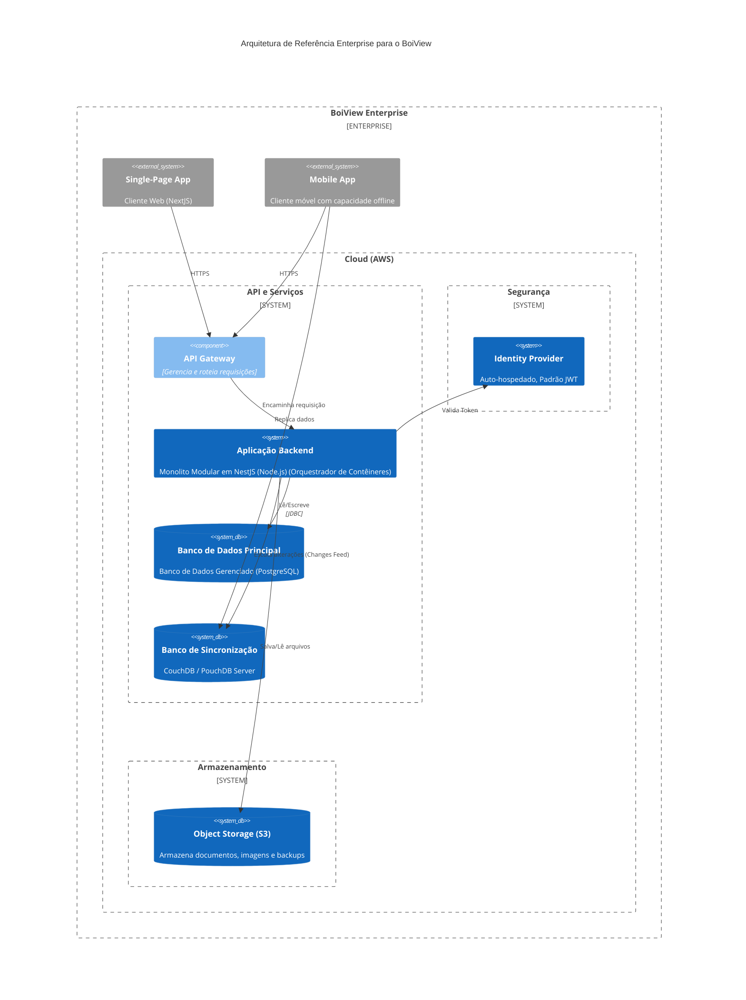
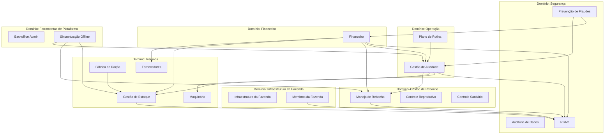
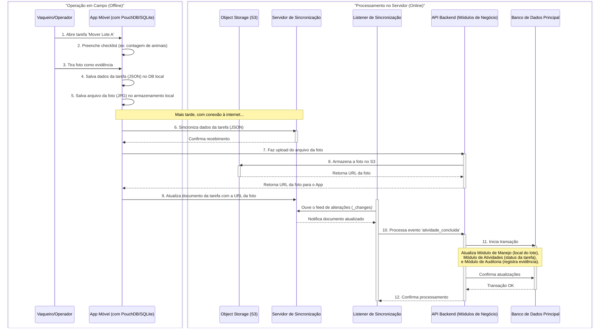

# Documento de Arquitetura de Software - BoiView

## 1. Introdução

### 1.1. Propósito e Escopo

Este documento descreve a arquitetura de software da plataforma BoiView, uma solução digital para gestão de pecuária de corte. O propósito é fornecer uma visão técnica abrangente que guiará o desenvolvimento, a implementação e a evolução do sistema.

O escopo abrange as camadas de negócio, aplicação e tecnologia, detalhando os componentes, as tecnologias, os padrões arquiteturais e as decisões que fundamentam o projeto, em alinhamento com os princípios do TOGAF e do modelo C4.

### 1.2. Público-Alvo

Este documento destina-se a arquitetos de software, desenvolvedores, equipes de infraestrutura, líderes técnicos e gestores de projeto.

### 1.3. Visão Geral do Projeto

A plataforma BoiView visa digitalizar e otimizar a gestão de fazendas de pecuária, resolvendo problemas como a falta de controle centralizado, a dificuldade de rastreabilidade e a necessidade de operar em ambientes com conectividade limitada. A solução foi desenvolvida de forma modular, com operação offline e foco em usabilidade e segurança.

A BoiView é fundamentada em cinco princípios arquiteturais principais:

1. **Design Modular Orientado a Domínios**: Separação clara dos domínios de negócio para facilitar manutenção e autonomia das equipes
2. **Operação Offline-First**: Projetada para funcionar sem interrupções mesmo com conectividade intermitente
3. **Controle de Acesso Baseado em Papéis**: Modelo de segurança abrangente com permissões granulares
4. **Prevenção de Fraudes**: Controles integrados para garantir a integridade dos dados
5. **Auditoria Abrangente**: Rastreabilidade completa de todas as operações do sistema

---

## 2. Módulos deste Projeto

### 2.1. Segurança
- Auditoria de dados
- RBAC - Controle de Acesso e Permissões
- Prevenção de Fraudes e Validações

### 2.2. Infraestrutura da Fazenda
- Fazenda
- Membros de Fazendas

### 2.3. Insumos
- Fornecedores
- Gestão de Estoque
- Maquinários
- Fábrica de Ração

### 2.4. Gestão de Rebanho
- Manejo de Rebanho
- Controle Reprodutivo
- Controle Sanitário

### 2.5. Operação
- Plano de Rotina
- Gestão de Atividade

### 2.6. Financeiro
- Financeiro

### 2.7. Ferramentas de Plataforma
- Plataformas e Sincronização
- BackOffice Administrativo

## 3. Descrição dos Domínios

A arquitetura do BoiView é organizada em domínios de negócio que representam as principais áreas de responsabilidade do sistema. Cada domínio encapsula um conjunto coeso de funcionalidades e dados, promovendo modularidade e clareza.

### 3.1. Domínio: Segurança (CS - Core System)

Este domínio abrange a segurança e auditoria do sistema, incluindo autenticação, autorização, log de atividades e prevenção a fraudes.

- **Módulos:** Auditoria de dados (AUDD), Controle de Acesso e Permissões (RBAC), Prevenção de Fraudes e Validações (PFV).
- **Propósito:** Fornece serviços fundamentais de segurança, autenticação e auditoria que suportam todos os outros domínios.
- **Integrações:** Interfaces com todos os domínios para autenticação, autorização e registro de auditoria.

### 3.2. Domínio: Infraestrutura da Fazenda (FM - Farm Management)

Este domínio abrange o mapeamento e gestão da estrutura física da fazenda e das pessoas que nela atuam.

- **Módulos:** Infraestrutura da Fazenda (FAZ), Membros (MEMB).
- **Propósito:** Gerencia propriedades rurais, áreas geográficas, infraestrutura física e pessoal da fazenda.
- **Integrações:** Fornece contexto de localização para o gerenciamento de rebanho e atividades operacionais.

### 3.3. Domínio: Gestão de Rebanho (LM - Livestock Management)

Este domínio abrange o controle e gestão do rebanho, incluindo manejo, reprodução e saúde animal.

- **Módulos:** Manejo de Rebanho (REB), Controle Reprodutivo (REP), Controle Sanitário (SAN).
- **Propósito:** Rastreia e gerencia o ciclo de vida dos animais, incluindo identificação, reprodução e saúde.
- **Integrações:** Integra-se com o Domínio de Infraestrutura da Fazenda para localizações e com o Domínio Operacional para tarefas de saúde.

### 3.4. Domínio: Insumos (SC - Supply Chain)

Este domínio abrange o controle de insumos e equipamentos utilizados na operação da fazenda.

- **Módulos:** Fornecedores (FORN), Gestão de Estoque (ESTQ), Maquinários (MAQ), Fábrica de Ração.
- **Propósito:** Gerencia relacionamentos com fornecedores, processos de aquisição e controle de inventário.
- **Integrações:** Conecta-se com o Domínio Financeiro para aprovações de compras e com o Domínio Operacional para consumo de inventário.

### 3.5. Domínio: Operação (OP - Operational)

Este domínio abrange a gestão das operações diárias da fazenda, incluindo planejamento de rotinas e atividades.

- **Módulos:** Plano de Rotina (ROT), Gestão de Atividade (TSK).
- **Propósito:** Gerencia a execução diária de atividades agrícolas, maquinário e planejamento de tarefas.
- **Integrações:** Interfaces com o Domínio de Infraestrutura da Fazenda para localizações e Domínio de Gestão de Rebanho para tarefas relacionadas a animais.

### 3.6. Domínio: Financeiro (FIN - Financial)

Este domínio abrange o gerenciamento financeiro da operação pecuária, incluindo plano de contas, lançamentos e relatórios.

- **Módulos:** Financeiro (FIM).
- **Propósito:** Gerencia aspectos financeiros, incluindo contabilidade, orçamento e relatórios.
- **Integrações:** Conecta-se com todos os domínios para rastreamento de custos e análise financeira.

### 3.7. Domínio: Ferramentas de Plataforma (PLAT - Platform Tools)

Este domínio abrange funcionalidades transversais que permeiam todo o sistema.

- **Módulos:** Plataformas e Sincronização (PLS), BackOffice Administrativo.
- **Propósito:** Fornece utilitários técnicos que suportam operação offline, integridade de dados e segurança.
- **Integrações:** Interfaces com todos os domínios para dar suporte à sincronização e monitoramento de segurança.

---

## 4. Direcionadores Arquiteturais

### 4.1. Requisitos de Negócio

- **Centralização da Gestão:** Unificar o controle de rebanho, infraestrutura, finanças e estoque.
- **Otimização de Processos:** Digitalizar tarefas manuais para melhorar a tomada de decisão.
- **Rastreabilidade:** Garantir o rastreamento completo de animais e operações.
- **Segurança e Prevenção a Fraudes:** Implementar mecanismos de validação digital.

### 4.2. Requisitos Não Funcionais

- **Operação Offline:** O sistema deve ser totalmente funcional em áreas sem acesso à internet, com sincronização automática posterior.
- **Usabilidade:** Interface intuitiva e adaptada aos diferentes perfis de usuário (do proprietário ao vaqueiro).
- **Escalabilidade:** A arquitetura deve suportar o crescimento do volume de dados e de usuários.
- **Segurança:** Controle de acesso rigoroso baseado em perfis (RBAC) e proteção de dados sensíveis.
- **Modularidade:** O sistema será construído em blocos de construção (Building Blocks) independentes e integrados.
- **Integridade de dados:** Mecanismos robustos de validação e resolução de conflitos.

## 5. Arquitetura de Referência Enterprise (C4 - Nível 1)

Esta seção descreve a arquitetura de alto nível em que a solução BoiView será implantada, focando nos aspectos de nuvem, comunicação e escalabilidade. O objetivo é garantir que a solução seja robusta, segura e capaz de crescer de forma sustentável.

### 5.1. Estratégia de Nuvem e Deployment

- **Provedor de Nuvem:** A solução será hospedada em um provedor de nuvem que ofereça um ecossistema maduro de serviços gerenciados.
- **Deployment:** A aplicação backend será containerizada com **Docker** e implantada em um **Orquestrador de Contêineres** (ex: Kubernetes, Fargate, etc.). Essa abordagem abstrai o gerenciamento de servidores, permitindo focar na aplicação, e facilita a escalabilidade.
- **Banco de Dados:** Utilizaremos um **Serviço de Banco de Dados Gerenciado** para PostgreSQL, que automatiza tarefas de administração como backups, patching e replicação, garantindo alta disponibilidade.
- **Armazenamento de Arquivos:** Um serviço de **Armazenamento de Objetos** será usado para armazenar arquivos estáticos, documentos e imagens, oferecendo durabilidade e baixo custo.

### 5.2. Camadas de Comunicação e Segurança

- **API Gateway:** Todas as requisições externas passarão por um **API Gateway**. Ele atuará como um ponto de entrada único, responsável por roteamento, limitação de taxa (rate limiting), e logging, além de ser um ponto central para a aplicação de políticas de segurança.
- **Comunicação Síncrona vs. Assíncrona:**
  - **Síncrona:** As interações diretas do usuário (ex: cadastrar uma fazenda, ler um relatório) serão tratadas de forma síncrona via API RESTful.
  - **Sincronização Offline:** A sincronização de dados do modo offline será gerenciada pelo **PouchDB** no cliente e um banco de dados compatível com **CouchDB** no servidor. O cliente replica os dados para o servidor de forma transparente. O backend, por sua vez, escuta o *feed de alterações* do CouchDB para processar os novos dados e aplicá-los ao banco de dados relacional principal (PostgreSQL), disparando as regras de negócio necessárias.
  - **Tarefas Assíncronas:** Para outras tarefas em segundo plano (ex: gerar relatórios complexos, enviar notificações), utilizaremos um serviço de **Fila de Mensagens** para desacoplar o processamento.

### 5.3. Escalabilidade e Disponibilidade

- **Escalabilidade Horizontal:** A arquitetura em contêineres permite escalar a aplicação horizontalmente, adicionando mais instâncias do backend conforme a demanda aumenta.
- **Banco de Dados Escalável:** O banco de dados gerenciado permite escalar a capacidade (CPU, memória) e suporta réplicas de leitura para distribuir a carga de consultas.
- **Alta Disponibilidade:** Os serviços em nuvem são projetados para serem altamente disponíveis e podem ser configurados para operar em múltiplas Zonas de Disponibilidade, protegendo a aplicação contra falhas em um único datacenter.

## 6. Arquitetura da Solução (C4 - Nível 3)

Esta seção detalha como os Building Blocks se conectam para formar uma solução coesa, alinhada aos requisitos de negócio.

### 6.1. Visão de Componentes (Módulos do Backend)

Esta visão detalha os principais **Módulos** que compõem a **Aplicação Backend**. Cada módulo representa um domínio de negócio coeso, com responsabilidades bem definidas. O objetivo é criar um sistema com baixo acoplamento entre os módulos e alta coesão interna em cada um deles.

> **Nota sobre os Clientes:** Tanto o **SPA (NextJS)** quanto o **Mobile App (React Native)** consomem os serviços expostos por esta API de forma agnóstica. A API atua como um *backend-for-frontend* (BFF) unificado, garantindo que as regras de negócio e o acesso aos dados sejam consistentes para todos os clientes.

### 6.2. Pilha Tecnológica

#### Backend
- **Linguagem e Framework**: Node.js com NestJS para o monolito modular
- **Banco de Dados Principal**: PostgreSQL para armazenamento relacional
- **Banco de Sincronização**: CouchDB no servidor e PouchDB no cliente móvel
- **Cache**: Redis para cache de dados e filas de mensagens

#### Frontend
- **Aplicação Web**: React (NextJS) para a interface administrativa
- **Aplicação Móvel**: React Native para operações em campo
- **Design System**: Material Design com personalização para ambiente rural

#### Infraestrutura
- **Containerização**: Docker para empacotamento
- **Orquestração**: Kubernetes ou AWS Fargate
- **Armazenamento de Objetos**: Serviço compatível com S3
- **Rede**: VPC com configuração de rede privada e WAF

### 6.3. Questões Transversais

- **Autenticação**: JWT com gestão de tokens para operação offline
- **Autorização**: RBAC com permissões granulares em nível de domínio e entidade
- **Sincronização de Dados**: Sincronização baseada em prioridades com resolução de conflitos
- **Auditoria**: Trilha de auditoria imutável para todas as operações significativas
- **Tratamento de Erros**: Degradação elegante com capacidade de retry em operações críticas
- **Cache**: Estratégia de cache em múltiplos níveis para otimização de desempenho

## 7. Padrões de Arquitetura e Design

### 7.1. Padrões de Arquitetura

- **Monolito Modular:** A aplicação backend será um Monolito Modular. Esta abordagem oferece um bom equilíbrio entre a simplicidade de um único deploy (monolito) e a organização de um sistema baseado em microserviços. Os domínios de negócio são separados em módulos com baixo acoplamento, o que facilita a manutenção e a evolução do sistema.
- **Arquitetura Limpa (Clean Architecture):** Os módulos seguirão os princípios da Arquitetura Limpa, separando as regras de negócio (entidades, casos de uso) das preocupações de infraestrutura (frameworks, bancos de dados). Isso torna o núcleo do negócio independente de tecnologia e mais fácil de testar.
- **Domain-Driven Design (DDD):** O sistema é estruturado em torno de domínios de negócio, com contextos delimitados claros, agregados e entidades bem definidas.

### 7.2. Padrões de Design

- **Injeção de Dependência (DI):** Utilizada extensivamente pelo NestJS para gerenciar o ciclo de vida dos componentes e desacoplar as classes.
- **Repository Pattern:** Abstrai a camada de acesso a dados, permitindo que os casos de uso interajam com um repositório sem conhecer os detalhes de implementação do banco de dados.
- **Data Transfer Object (DTO):** Usado para transferir dados entre as camadas da aplicação, garantindo que apenas as informações necessárias sejam expostas.
- **Factory Method:** Criação de objetos complexos através de métodos dedicados que encapsulam a lógica de construção.
- **Strategy Pattern:** Aplicado nos algoritmos de sincronização e resolução de conflitos, permitindo diferentes estratégias baseadas no tipo de entidade.

## 8. Diagrama de Sequência - Sincronização Offline

**Descrição do Fluxo:**

1. **Acesso Offline:** O operador de campo abre a tarefa no aplicativo móvel, que já foi previamente sincronizada e está disponível localmente.
2. **Preenchimento de Dados:** Ele preenche os dados necessários, como um checklist de verificação.
3. **Captura de Evidência:** O operador tira uma foto diretamente pelo aplicativo para comprovar a execução da tarefa.
4. **Armazenamento Local (Dados):** O aplicativo salva as informações estruturadas (o JSON da tarefa) no banco de dados local (PouchDB ou SQLite).
5. **Armazenamento Local (Arquivo):** O arquivo da imagem (JPG) é salvo no sistema de arquivos do próprio dispositivo.
6. **Sincronização de Dados:** Assim que o dispositivo encontra uma conexão com a internet, ele inicia o processo de sincronização. Primeiro, envia os dados JSON da tarefa para o servidor de sincronização (CouchDB).
7. **Upload de Arquivo Binário:** Em paralelo (ou na sequência), o aplicativo faz o upload do arquivo da foto para um endpoint específico na API Backend. Arquivos binários não são sincronizados via CouchDB para otimizar a performance.
8. **Armazenamento em Object Storage:** A API recebe a foto e a armazena de forma segura e escalável no Amazon S3, que retorna uma URL única para o arquivo.
9. **Atualização do Documento:** A API retorna a URL da foto para o aplicativo, que então atualiza o documento da tarefa no CouchDB, adicionando a URL da evidência. Agora o documento está completo.
10. **Processamento Assíncrono:** O `SyncListener` detecta o documento finalizado no CouchDB e o envia para a API principal para processamento da lógica de negócio.
11. **Execução da Lógica de Negócio:** A API executa uma transação no banco de dados principal (PostgreSQL), atualizando todos os módulos impactados: o `Manejo de Rebanho` (para refletir a nova localização dos animais), a `Gestão de Atividades` (para marcar a tarefa como concluída) e a `Auditoria` (para vincular a evidência à operação).
12. **Confirmação:** Após a conclusão bem-sucedida da transação, o fluxo é finalizado. Este modelo garante resiliência e a integridade dos dados, separando a coleta de informações em campo do processamento complexo no servidor.

Este padrão **move a complexidade da sincronização para a camada de dados** (PouchDB/CouchDB), simplificando drasticamente o código do cliente e do backend, ao mesmo tempo que cria um sistema de sincronização mais resiliente e eficiente.

## 9. Decisões Arquiteturais (ADRs)

Esta seção registra as decisões arquiteturais mais significativas tomadas durante o projeto. Cada ADR descreve o contexto de uma decisão, as alternativas consideradas e a justificativa para a escolha feita.

### ADR-001: Adoção de Arquitetura Monolítica Modular

- **Status:** Aceito
- **Contexto:** O sistema precisa equilibrar a complexidade do domínio com a velocidade de desenvolvimento e a simplicidade operacional.
- **Decisão:** Adotaremos uma arquitetura monolítica modular, com domínios de negócio bem segregados em módulos coesos.
- **Consequências:**
  - Positivas: Desenvolvimento mais rápido, operação simplificada, consistência transacional.
  - Negativas: Risco de acoplamento entre módulos, escalabilidade vertical principalmente.
- **Alternativas Consideradas:**
  - Microserviços: Rejeitados devido à complexidade operacional e overhead para o tamanho atual do projeto.
  - Serverless: Rejeitado devido à necessidade de lógica de negócio complexa e estado persistente.

### ADR-002: Estratégia Offline-First com Sincronização Baseada em CouchDB/PouchDB

- **Status:** Aceito
- **Contexto:** Os usuários precisam de funcionalidade completa mesmo em áreas rurais com conectividade limitada ou inexistente.
- **Decisão:** Implementaremos uma arquitetura offline-first usando PouchDB no cliente móvel e CouchDB no servidor para sincronização de dados.
- **Consequências:**
  - Positivas: Funcionamento sem interrupções, sincronização robusta e automática.
  - Negativas: Complexidade na resolução de conflitos, modelo de dados parcialmente denormalizado.
- **Alternativas Consideradas:**
  - Sincronização customizada: Rejeitada devido à complexidade e risco de bugs.
  - Operações offline limitadas: Rejeitada por não atender às necessidades dos usuários em campo.

### ADR-003: Autenticação com JWT e Suporte a Modo Offline

- **Status:** Aceito
- **Contexto:** O sistema precisa autenticar usuários mesmo quando estão offline.
- **Decisão:** Utilizaremos tokens JWT com validade estendida e refresh token armazenado localmente.
- **Consequências:**
  - Positivas: Autenticação possível offline, baixa latência em verificações.
  - Negativas: Revogação de acesso não imediata para usuários offline.
- **Alternativas Consideradas:**
  - OAuth2 padrão: Rejeitado devido à dependência de conexão para renovação de tokens.
  - Credenciais armazenadas localmente: Rejeitadas devido a riscos de segurança.

### ADR-004: Banco de Dados PostgreSQL como Armazenamento Principal

- **Status:** Aceito
- **Contexto:** O sistema requer um banco de dados robusto com suporte a transações e relações complexas entre entidades.
- **Decisão:** Utilizaremos PostgreSQL como banco de dados principal, complementado por CouchDB para sincronização.
- **Consequências:**
  - Positivas: Forte consistência, excelente suporte a consultas complexas, ecossistema maduro.
  - Negativas: Necessidade de mapeamento entre o modelo relacional e o modelo de documentos usado na sincronização.
- **Alternativas Consideradas:**
  - MongoDB: Rejeitado devido à necessidade de transações ACID complexas em múltiplas entidades.
  - MySQL: Considerado viável, mas PostgreSQL foi preferido por recursos avançados e extensibilidade.

### ADR-005: Mobile Cross-Platform com React Native

- **Status:** Aceito
- **Contexto:** Precisamos oferecer suporte a iOS e Android com recursos limitados de desenvolvimento.
- **Decisão:** Desenvolveremos a aplicação móvel com React Native.
- **Consequências:**
  - Positivas: Base de código única para ambas plataformas, reutilização de habilidades com o frontend web.
  - Negativas: Performance potencialmente inferior a aplicativos nativos em alguns casos específicos.
- **Alternativas Consideradas:**
  - Flutter: Considerado viável, mas React Native foi preferido devido à maior sinergia com o stack web.
  - Aplicativos nativos separados: Rejeitados devido a limitações de recursos de desenvolvimento.

## 10. Implementação e Diretrizes

### 10.1. Roteiro de Implementação

1. **Fase de Fundação** (3 meses)
   - Implementação dos Domínios Core System e Platform Tools
   - Estruturação da arquitetura básica e infraestrutura em nuvem
   - Implementação do mecanismo de sincronização offline

2. **Fase de Núcleo de Negócio** (4 meses)
   - Implementação dos Domínios Farm Management e Livestock Management
   - Desenvolvimento da aplicação móvel com funcionalidades básicas
   - Desenvolvimento da interface web administrativa

3. **Fase de Operações** (3 meses)
   - Implementação dos Domínios Supply Chain e Operational
   - Expansão das funcionalidades móveis para operações de campo
   - Integração completa entre os módulos existentes

4. **Fase Financeira** (2 meses)
   - Implementação do Domínio Financial
   - Refinamento das integrações entre domínios
   - Testes de sistema completos

### 10.2. Diretrizes de Desenvolvimento

- **Código Limpo:** Seguir princípios SOLID e práticas de Clean Code
- **Testes Automatizados:** Cobertura mínima de 80% para lógica de negócio
- **Revisão de Código:** Todas as alterações devem passar por revisão de pares
- **Documentação:** APIs documentadas com OpenAPI/Swagger
- **Mensagens de Commit:** Seguir o padrão Conventional Commits

### 10.3. Observabilidade e Monitoramento

- **Logging:** Formato estruturado JSON com níveis de severidade consistentes
- **Métricas:** Monitoramento de performance de APIs e sincronização
- **Rastreamento:** Trace IDs para acompanhar operações através dos componentes
- **Alertas:** Configurados para falhas de sincronização e erros críticos

## 11. Conclusão

A arquitetura do BoiView foi projetada para atender aos desafios específicos da gestão pecuária em ambientes rurais, com foco em operação offline, integridade de dados e usabilidade para diferentes perfis de usuários.

A abordagem de monolito modular com domínios bem definidos oferece um equilíbrio entre a velocidade de desenvolvimento e a clareza conceitual do sistema. A estratégia offline-first com sincronização robusta garante que os usuários possam trabalhar sem interrupções mesmo em áreas com conectividade limitada.

A arquitetura equilibra diversas preocupações chave:
- **Funcionalidade vs. Conectividade:** Garantindo que recursos essenciais funcionem offline
- **Segurança vs. Usabilidade:** Mantendo forte segurança sem dificultar operações de campo
- **Flexibilidade vs. Consistência:** Permitindo abordagens específicas por domínio enquanto garante coesão do sistema

Ao adotar esta arquitetura, o BoiView visa fornecer uma plataforma robusta, escalável e amigável que transforme a gestão pecuária para seus stakeholders.

## 12. Glossário

| Termo | Definição |
|------|------------|
| ADR | Architecture Decision Record - Registro de Decisão Arquitetural |
| RBAC | Role-Based Access Control - Controle de Acesso Baseado em Papéis |
| API | Application Programming Interface - Interface de Programação de Aplicação |
| JWT | JSON Web Token - Token de autenticação baseado em JSON |
| DDD | Domain-Driven Design - Design Orientado a Domínio |
| BFF | Backend For Frontend - Backend específico para um frontend |
| CS | Core System - Domínio do Sistema Core |
| FM | Farm Management - Domínio de Gestão da Fazenda |
| LM | Livestock Management - Domínio de Gestão de Rebanho |
| SC | Supply Chain - Domínio de Cadeia de Suprimentos |
| OP | Operational - Domínio Operacional |
| FIN | Financial - Domínio Financeiro |
| PLAT | Platform Tools - Domínio de Ferramentas de Plataforma |

---

## 3. Domain Architecture

The BoiView system is organized into seven distinct business domains, each with clear responsibilities and boundaries:

### 3.1 Core System Domain (CS)

**Purpose**: Provides foundational security, authentication, and audit services that support all other domains.

**Key Modules**:
- Role-Based Access Control (RBAC)
- Data Audit (AUDD)

**Key Integration Points**: Interfaces with all domains for authentication, authorization, and audit logging.

### 3.2 Farm Management Domain (FM)

**Purpose**: Manages rural properties, geographical areas, physical infrastructure, and farm personnel.

**Key Modules**:
- Farm Module (FAZ) - geographical and physical aspects
- Farm Members Module (MEMB) - human resources

**Key Integration Points**: Provides location context for livestock management and operational activities.

### 3.3 Livestock Management Domain (LM)

**Purpose**: Tracks and manages the lifecycle of livestock animals, including identification, reproduction, and health.

**Key Modules**:
- Livestock Management Module (REB)
- Reproductive Control Module (REP)
- Sanitary Control Module (SAN)

**Key Integration Points**: Integrates with Farm Management for locations and with Operational Domain for health tasks.

### 3.4 Supply Chain Domain (SC)

**Purpose**: Manages supplier relationships, procurement processes, and inventory control.

**Key Modules**:
- Suppliers Module (FORN)
- Inventory Module (ESTQ)

**Key Integration Points**: Connects with Financial Domain for procurement approvals and with Operational Domain for inventory consumption.

### 3.5 Operational Domain (OP)

**Purpose**: Manages day-to-day execution of farm activities, machinery, and task planning.

**Key Modules**:
- Machinery Module (MAQ)
- Routine Planning Module (ROT)
- Activities Module (TSK)

**Key Integration Points**: Interfaces with Farm Management for locations and Livestock Management for animal-related tasks.

### 3.6 Financial Domain (FIN)

**Purpose**: Manages financial aspects including accounting, budgeting, and reporting.

**Key Modules**:
- Financial Management Module (FIM)

**Key Integration Points**: Connects with all domains for cost tracking and financial analysis.

### 3.7 Platform Tools Domain (PLAT)

**Purpose**: Provides technical utilities supporting offline-first operation, data integrity, and security.

**Key Modules**:
- Platform Sync Module (PLS)
- Fraud Prevention Module (PFV)

**Key Integration Points**: Interfaces with all domains to support synchronization and security monitoring.

### 3.8 Domain Relationships

The domains interact through well-defined interfaces with strict boundaries to maintain separation of concerns. Cross-domain operations are managed through events and carefully designed integration points that preserve domain autonomy while enabling necessary collaboration.

The Core System Domain and Platform Tools Domain serve as supporting domains that provide cross-cutting functionality to all business domains. The Farm Management Domain provides foundational context (locations, personnel) that other domains leverage for their operations.

---

## 4. Application Architecture

### 4.1 Web Application

- **Architecture Pattern**: Single Page Application (SPA)
- **Offline Capabilities**: Progressive Web App (PWA) features for administrative functions
- **Browser Support**: Chrome, Firefox, Safari, Edge (latest two versions)
- **Responsive Design**: Optimized for desktop and tablet usage

### 4.2 Mobile Application

- **Development Approach**: React Native cross-platform
- **Platform Support**: Android 10+ and iOS 14+
- **Offline Operation**: Full offline functionality with data synchronization
- **Device Integration**: Camera for animal identification, GPS for location tracking
- **Distribution**: Google Play Store and Apple App Store

### 4.3 API Architecture

- **Style**: REST with JSON payloads
- **Authentication**: JWT with token refresh mechanism
- **Versioning**: URL-based versioning (e.g., /api/v1/)
- **Documentation**: OpenAPI/Swagger specification
- **Error Handling**: Standardized error responses with codes and messages

---

## 5. Data Architecture

### 5.1 Data Storage Strategy

- **Primary Database**: PostgreSQL for centralized storage
- **Mobile Database**: SQLite for offline operation
- **Caching Layer**: Redis for performance optimization
- **Object Storage**: For documents and media files

### 5.2 Synchronization Strategy

- **Approach**: Priority-based incremental synchronization
- **Conflict Resolution**: Entity-specific resolution strategies with versioning
- **Sync Units**: Logical groupings of related data for atomic synchronization
- **Connectivity Detection**: Adaptive behavior based on network quality

### 5.3 Data Modeling Principles

- **Domain Isolation**: Data models aligned with domain boundaries
- **Audit Fields**: Consistent tracking of creation and modification across all entities
- **Soft Deletion**: Records preserved with deletion markers rather than hard deletion
- **Versioning**: Support for detecting conflicts during synchronization

---

## 6. Infrastructure Architecture

### 6.1 Deployment Architecture

- **Container Orchestration**: Kubernetes for scalability and resilience
- **Service Discovery**: DNS-based with health checking
- **Environment Strategy**: Development, Testing, Staging, Production

### 6.2 CI/CD Pipeline

- **Source Control**: Git with feature branching strategy
- **Build Automation**: Jenkins pipelines
- **Testing Strategy**: Unit, integration, and end-to-end testing
- **Deployment Automation**: Continuous deployment to non-production environments

### 6.3 Observability Strategy

- **Logging**: Centralized with structured JSON format
- **Monitoring**: System and business metrics
- **Alerting**: Threshold-based with escalation policies
- **Tracing**: Distributed tracing for service interactions

### 6.4 Scalability Approach

- **Horizontal Scaling**: For API services and background processors
- **Database Scaling**: Read replicas with connection pooling
- **Caching Strategy**: Multi-level caching for frequently accessed data

---

## 7. Security Architecture

### 7.1 Authentication & Authorization

- **User Authentication**: Multi-factor with offline support
- **Authorization Model**: Role-based with fine-grained permissions
- **Token Management**: Secure token storage with refresh mechanism

### 7.2 Data Protection

- **Encryption**: Data encrypted at rest and in transit
- **Sensitive Data**: Special handling for personally identifiable information
- **Key Management**: Secure key storage and rotation

### 7.3 Fraud Prevention

- **Anomaly Detection**: Monitoring for unusual patterns
- **Segregation of Duties**: Critical operations require multiple actors
- **Alert System**: Real-time notification of suspicious activities

---

## 8. Implementation Roadmap

### 8.1 Development Phases

1. **Foundation Phase**: Core System and Platform Tools domains
2. **Core Business Phase**: Farm Management and Livestock Management domains
3. **Operations Phase**: Supply Chain and Operational domains
4. **Financial Phase**: Financial domain and integrations

### 8.2 Key Milestones

- Core security infrastructure completion
- Offline synchronization framework implementation
- Mobile application alpha release
- Web administration interface release
- Complete system beta testing
- Production deployment and rollout

### 8.3 Technical Debt Management

- Regular refactoring cycles built into sprint planning
- Automated code quality checks in CI pipeline
- Architecture review sessions to maintain alignment with vision

---

## 9. Architectural Decision Records

The architecture reflects several key decisions that address specific challenges of the BoiView system:

1. **Adoption of Domain-Driven Design**: Provides clear boundaries for the complex domain space
2. **Offline-First Approach**: Addresses rural connectivity challenges
3. **Cross-Platform Mobile Strategy**: Balances development efficiency with performance
4. **Dual-Database Strategy**: Enables robust offline operation with eventual consistency
5. **Token-Based Authentication**: Supports offline operation while maintaining security
6. **Event-Driven Integration**: Reduces coupling between domains
7. **Cloud-Agnostic Infrastructure**: Provides deployment flexibility

Detailed rationales for these decisions are documented in the Architecture Decision Records (ADRs).

---

## 10. Conclusion

The BoiView architecture is specifically designed to address the challenges of livestock management in rural environments with limited connectivity. Its domain-driven, offline-first approach ensures that the system can deliver value even in challenging conditions while maintaining data integrity and security.

The architecture balances several key concerns:
- **Functionality vs. Connectivity**: Ensuring core features work offline
- **Security vs. Usability**: Maintaining strong security without hindering field operations
- **Flexibility vs. Consistency**: Allowing for domain-specific approaches while ensuring system cohesion

By adopting this architecture, BoiView aims to provide a robust, scalable, and user-friendly platform that transforms livestock management for its stakeholders.

---

## Appendix A: Reference Documentation

For detailed domain specifications, please refer to:

1. [Core System Domain](/base/docs/04-ARQ/v0/07-domains/01-CS/README.md)
2. [Farm Management Domain](/base/docs/04-ARQ/v0/07-domains/02-FM/README.md)
3. [Livestock Management Domain](/base/docs/04-ARQ/v0/07-domains/03-LM/README.md)
4. [Supply Chain Domain](/base/docs/04-ARQ/v0/07-domains/04-SC/README.md)
5. [Operational Domain](/base/docs/04-ARQ/v0/07-domains/05-OP/README.md)
6. [Financial Domain](/base/docs/04-ARQ/v0/07-domains/06-FIN/README.md)
7. [Platform Tools Domain](/base/docs/04-ARQ/v0/07-domains/07-PLAT/README.md)

For system views and diagrams, please refer to:

1. [System Context](/base/docs/04-ARQ/v0/05-system-views/01-context-diagram.md)
2. [Container View](/base/docs/04-ARQ/v0/05-system-views/02-container-diagram.md)
3. [Component View](/base/docs/04-ARQ/v0/05-system-views/03-component-diagram.md)
4. [Deployment View](/base/docs/04-ARQ/v0/05-system-views/04-deployment-diagram.md)

---

## Appendix B: Glossary

| Term | Definition |
|------|------------|
| ADR | Architecture Decision Record |
| CS | Core System Domain |
| FM | Farm Management Domain |
| LM | Livestock Management Domain |
| SC | Supply Chain Domain |
| OP | Operational Domain |
| FIN | Financial Domain |
| PLAT | Platform Tools Domain |
| JWT | JSON Web Token |
| RBAC | Role-Based Access Control |
| PWA | Progressive Web Application |
