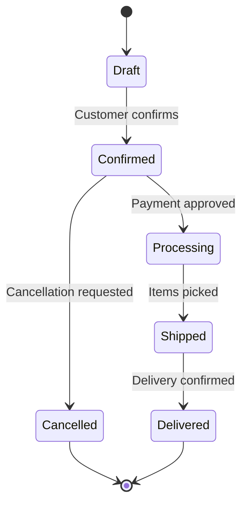

# Domain-Specific Architecture Guideline

This document provides detailed instructions for creating the domain-specific architecture documentation for the project, as outlined in section `07-domains` of the main architecture structure.

## 1. Directory and File Structure for Domains

Each business domain will have its own set of detailed documents. The structure is as follows:

```
/07-domains/
  └── domain-catalog.md
  └── domain-relationships.md
  │
  ├── 01-domain-A/  # Replace with actual domain name (e.g., livestock-management)
  │   ├── 01-domain-model.md
  │   ├── 02-entities-relationships.md
  │   ├── 03-business-rules.md
  │   ├── 04-state-machines.md
  │   └── README.md  # Final delivery document for Domain A
  │
  ├── 02-domain-B/ # Example for another domain
  │   ├── 01-domain-model.md
  │   ├── 02-entities-relationships.md
  │   ├── 03-business-rules.md
  │   ├── 04-state-machines.md
  │   └── README.md  # Final delivery document for Domain B
```

## 2. Domain Documentation Development

This section details the content required for each document within a specific domain's folder.

### CRITICAL: Adherence to Pre-Defined Domains

**This is the most important guideline for this section.** The business domains for the system have been previously analyzed and are considered **frozen**. The purpose of this documentation effort is exclusively to detail these existing domains, not to create, alter, or remove them.

**This is the most important guideline for this section.** The modules that are contained within the business domains have been previously analyzed and are considered **frozen**. The purpose of this documentation effort is exclusively to detail the domains based on the modules it contains and how they fit together to determine the domain's architecture. Do not create, alter, or remove modules.

For clarity:
- A **Domain** is a high-level abstraction that groups a set of related modules based on business capability.
- A **Module** represents a specific, cohesive unit of functionality. Each module must belong to one and only one domain.

-   **DO NOT CREATE NEW MODULES**: The list of modules derived from the `domain-catalog.md` is exhaustive. Do not invent or infer any new modules.
-   **DO NOT REMOVE EXISTING MODULES**: All modules listed in the catalog must be documented.
-   **DO NOT ALTER MODULE SCOPE**: The fundamental responsibilities and goals of each module are pre-defined. The documentation must reflect the original design and intent without modification.

### 2.1 Domain Overview Documentation

Create the following documents in the `07-domains/01-domain-overview/` folder:

#### domain-catalog.md
- Based on answers to questions 32-35
- Include:
  - List of all identified business domains
  - Brief description of each domain's responsibilities
  - Key stakeholders for each domain

#### domain-relationships.md
- Based on answers to question 33
- Include:
  - Diagram illustrating relationships between **domains**, not modules.
  - A description of the nature of these dependencies.
- **Guideline**: The analysis of inter-domain dependencies must be derived from the interactions between their constituent modules. Refer to the artifact provided that contains the "modules understanding" document to identify which modules from one domain interact with modules from another. The relationship exists at the domain level if any of their respective modules are dependent on each other.
- **IMPORTANT**: The final diagram must visually represent dependencies at the domain level only. While it is helpful to list the modules inside a domain's visual boundary (e.g., a subgraph), the dependency arrows must connect the domains themselves, not the individual modules. This keeps the focus on the high-level architecture.

### 2.2 Detailed Domain Documentation

For each specific domain (e.g., `livestock-management`), create the following documents:

#### domain-model.md
- Based on answers to questions 36-39
- Include:
  - Detailed description of the domain model
  - Key concepts and entities
  - Bounded context diagram for the domain

#### entities-relationships.md
- Based on answers to question 37
- Include:
  - Detailed list of entities and value objects
  - Entity-Relationship Diagram (ERD)
  - Data dictionary with field definitions, types, and constraints
  - Indexing strategies for tables

#### business-rules.md
- Based on answers to questions 38-39
- Include:
  - Domain-specific business rules and invariants
  - Data validation rules
  - Access and authorization policies specific to the domain

#### state-machines.md
- Based on answers to question 40
- Include:
  - State machine diagrams for entities with complex lifecycles
  - Description of states, events, and transitions

## 3. Guidelines for Domain Documentation

When generating the domain-specific documents, adhere to the following principles to ensure clarity, consistency, and accuracy:

1.  **Contextual Continuity**: Each document within a domain's folder must be a logical and consistent continuation of the others. For example, the `entities-relationships.md` must accurately reflect the concepts introduced in the `domain-model.md`, and the business rules must apply to the defined entities.
2.  **Progressive Refinement**: Develop the domain documentation iteratively. Start with a high-level model identifying the core entities and their relationships. In subsequent steps, progressively add detail, such as specific attributes in the ERD, complex business rules, and state machine transitions.
3.  **Consistency**: Use consistent terminology for entities, attributes, and concepts across all documents for a single domain. This consistency should also be maintained across different domains where concepts overlap.
4.  **Traceability**: Maintain clear references to the questionnaire questions (32-40) that support specific domain design decisions.
5.  **Gap Identification**: If the questionnaire responses are ambiguous or incomplete regarding a specific business rule or data constraint, clearly document this as a gap that requires stakeholder clarification.

## 4. Examples and Templates

### Example Domain Model Document:

```markdown
# Model: Customer

## Identification
**Name:** Customer
**Description:** Represents a platform customer who can make purchases
**Responsibility:** Maintain customer information and relationship history

## Structure
**Primary Key:** id (UUID v4)
**Deletion Strategy:** Soft Delete (is_active field)

### Fields
| Name | Type | Description | Required |
|------|------|-------------|-----------|
| id | UUID | Unique identifier | Yes |
| name | String(100) | Full name | Yes |
| email | String(150) | Contact email | Yes |
| phone | String(20) | Contact phone | No |
| birth_date | Date | Date of birth | No |
| type | Enum | Individual or Company | Yes |
| document | String(20) | Tax ID or EIN | Yes |
| is_active | Boolean | Indicates if active | Yes |
| created_at | Timestamp | Creation date | Yes |
| updated_at | Timestamp | Last update date | Yes |
| created_by | UUID | User who created | Yes |
| updated_by | UUID | Last user to update | Yes |

## Indexing
1. **Primary Index:** id
2. **Secondary Index:** email (for email lookup)
3. **Secondary Index:** document (for document lookup)
4. **Composite Index:** (name, is_active) for filtered listings
```

### Example State Machine:

```markdown
# State Machine: Order

## States
- **Draft:** Initial order state
- **Confirmed:** Order confirmed by customer
- **Processing:** Order being processed
- **Shipped:** Order sent for delivery
- **Delivered:** Order delivered to customer
- **Cancelled:** Order cancelled

## Transitions
1. Draft → Confirmed
   - **Event:** Customer confirms order
   - **Validations:** 
     - Order must have at least one item
     - Payment method must be valid
   - **Actions:** 
     - Reserve inventory
     - Record confirmation date

[continue with other transitions...]

## Diagram

```

## Conclusion

This guideline provides a focused approach for documenting each business domain, ensuring that the core business logic, rules, and data models are clearly defined and understood.
