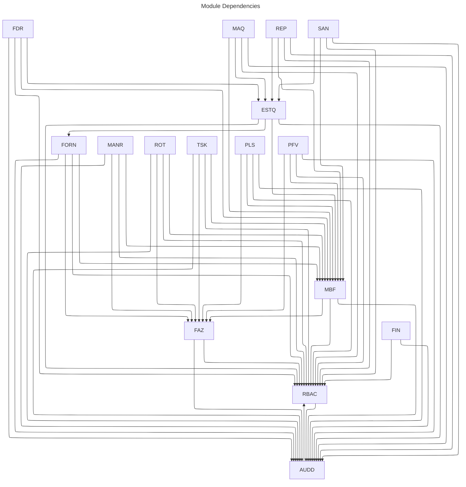

# BoiView DQER Modules - Comprehensive Documentation

This document provides a structured understanding of all modules in the BoiView project's DQER (Documento de
Qualificação de Escopo e Requisitos), including their descriptions, functionalities, requirements, dependencies,
integrations, access controls, critical actions, indicators, and future opportunities.

## Table of Contents

1. [Introduction](#introduction)
2. [Core System Modules](#core-system-modules)
    - [Data Audit Module (AUDD)](#data-audit-module-audd)
    - [Role-Based Access Control Module (RBAC)](#role-based-access-control-module-rbac)
3. [Farm Management Modules](#farm-management-modules)
    - [Farm Module (FAZ)](#farm-module-faz)
    - [Farm Members Module (MEMB)](#farm-members-module-memb)
4. [Livestock Management Modules](#livestock-management-modules)
    - [Livestock Management Module (REB)](#livestock-management-module-reb)
    - [Reproductive Control Module (REP)](#reproductive-control-module-rep)
    - [Sanitary Control Module (SAN)](#sanitary-control-module-san)
5. [Operational Modules](#operational-modules)
    - [Suppliers Module (FORN)](#suppliers-module-forn)
    - [Inventory Module (ESTQ)](#inventory-module-estq)
    - [Feed Factory Module (FDR)](#feed-factory-module-fdr)
    - [Machinery Module (MAQ)](#machinery-module-maq)
    - [Routine Planning Module (ROT)](#routine-planning-module-rot)
    - [Activities Module (TSK)](#activities-module-tsk)
6. [Financial Module](#financial-module)
    - [Financial Management Module (FIN)](#financial-management-module-fin)
7. [Platform Tools](#platform-tools)
    - [Platform Sync Module (PLS)](#platform-sync-module-pls)
    - [Fraud Prevention Module (PFV)](#fraud-prevention-module-pfv)
    - [Backoffice Administration Module (BKO)](#backoffice-administration-module-bko)
8. [Cross-Cutting Concerns](#cross-cutting-concerns)
9. [Summary](#summary)

Cada módulo incluirá seções detalhadas sobre:

- Descrição e escopo
- Funcionalidades principais
- Requisitos destacados
- Integrações com outros módulos
- Controle de acesso
- **Jornadas de usuário e histórias de usuário**
- Indicadores de desempenho
- Oportunidades futuras

## Introduction

The BoiView project is a comprehensive livestock management system designed to handle all aspects of farm operations
with a focus on offline-first architecture for field operations. The system is divided into multiple modules, each
responsible for specific functionalities while maintaining integration with other modules.

Key architectural principles across all modules include:

1. **Offline-First Design**: All modules support operation without internet connectivity with robust synchronization and
   conflict resolution mechanisms.
2. **Role-Based Access Control**: Granular permissions for different user roles across all modules.
3. **Audit Trail**: Comprehensive logging of all operations for traceability and compliance.
4. **Security**: Emphasis on data protection, especially for critical operations requiring approval or identity
   confirmation.
5. **Integration**: Well-defined dependencies and integrations between modules.

## Core System Modules

### Data Audit Module (AUDD)

#### Description

The Data Audit module is responsible for logging all user actions in the system for traceability, compliance, and
security purposes. It creates an immutable record of all operations, supporting regulatory compliance, fraud prevention,
and operational auditing.

#### Key Functionalities

- Immutable logging of all system operations with user identification
- Comprehensive metadata capture (timestamp, location, device)
- Advanced querying and filtering of audit logs
- Configurable notifications for suspicious activities
- Audit report generation for compliance purposes
- Integration with all system modules for centralized auditing

#### Requirements Highlights

- Tamper-proof logging with cryptographic verification
- Configurable data retention policies
- Offline operation with synchronization priority
- Advanced filtering capabilities
- Role-based access to audit data

#### Integrations

- Connects with role-based access control module (RBAC)

#### Access Control

- Standard users: Access to limited personal audit records
- Supervisors: Access to team audit records
- Auditors/Managers: Full access to farm audit data
- Administrators: System-wide audit access

#### Performance Indicators

- Log integrity verification rate
- System coverage (% of operations logged)
- Query response time
- Storage efficiency metrics

#### Future Opportunities

- Advanced anomaly detection
- AI-powered pattern analysis
- Blockchain-based immutable audit trails
- Advanced visual forensics tools

#### Histórias de Usuário

| ID          | Título                        | Descrição                                                                                        |
|-------------|-------------------------------|--------------------------------------------------------------------------------------------------|
| US-AUDD-001 | Registro de ações de usuários | Registro automático de todas as ações relevantes dos usuários para rastreabilidade e auditoria   |
| US-AUDD-002 | Consulta e filtragem de logs  | Busca e filtragem de registros por múltiplos critérios para análise e investigação               |
| US-AUDD-003 | Relatórios personalizados     | Geração de relatórios com diferentes agrupamentos e visualizações para análise de comportamentos |
| US-AUDD-004 | Exportação de dados           | Exportação manual e automatizada de logs em diversos formatos para análise externa               |
| US-AUDD-005 | Alertas para eventos críticos | Configuração de alertas para notificar sobre ações suspeitas ou críticas no sistema              |

### Role-Based Access Control Module (RBAC)

#### Description

The RBAC module manages all aspects of user authentication, authorization, and permission management across the system.
It defines the security framework for user access to all other modules.

#### Key Functionalities

- User, role, and permission management
- Multi-factor authentication
- Session management and security policies
- Password policies and recovery mechanisms
- Access auditing and reporting
- Permission inheritance and hierarchies

#### Requirements Highlights

- Granular permission control at entity and operation levels
- Support for complex organizational hierarchies
- Offline authentication capabilities
- Secure credential storage
- Session timeout and inactivity management
- Failed login attempt monitoring

#### Integrations

- Provides authentication and authorization services to all modules
- Integrates with audit module for security logging
- Connects with farm module for farm context
- Works with notification system for security alerts

#### Access Control

- System administrators: Full RBAC management
- Farm managers: Farm-level user and role management
- Users: Self-service profile management

#### Critical Actions

- Adding administrative users
- Modifying security policies
- Granting elevated permissions
- Bulk permission changes

#### Performance Indicators

- Authentication success rate
- Authorization decision time
- Session management efficiency
- Password recovery success rate
- Failed login attempt rate

#### Future Opportunities

- Advanced biometric authentication
- Risk-based contextual authentication
- Single sign-on integration
- Delegated administration capabilities

#### Histórias de Usuário

| ID          | Título                            | Descrição                                                          |
|-------------|-----------------------------------|--------------------------------------------------------------------|
| US-RBAC-001 | Cadastro de novos usuários        | Cadastro de usuários com atribuição de perfil e validação de dados |
| US-RBAC-002 | Edição de dados de usuários       | Manutenção de dados cadastrais com registro de auditoria           |
| US-RBAC-003 | Desativação de usuários           | Revogação de acesso mantendo histórico de ações                    |
| US-RBAC-004 | Criação de papéis personalizados  | Definição de papéis com permissões específicas                     |
| US-RBAC-005 | Atribuição de permissões a papéis | Controle granular de acesso às funcionalidades                     |
| US-RBAC-006 | Atribuição de papéis a usuários   | Associação de usuários a papéis pré-definidos                      |
| US-RBAC-007 | Autenticação em dois fatores      | Camada extra de segurança para funções críticas                    |
| US-RBAC-008 | Recuperação de senha              | Processo seguro para redefinição de credenciais                    |
| US-RBAC-009 | Consulta de logs de acesso        | Monitoramento de tentativas de acesso e atividade de usuários      |
| US-RBAC-010 | Gestão de sessões ativas          | Visualização e encerramento de sessões de usuários                 |
| US-RBAC-011 | Validação hierárquica             | Aprovação de operações sensíveis por níveis superiores             |

## Farm Management Modules

### Farm Module (FAZ)

#### Description

The Farm module manages physical and organizational structures of farms, including geographical mapping of properties,
retreats, pastures, and infrastructure. It forms the foundation for all other farm-related operations and provides
critical geospatial data for the system.

#### Key Functionalities

- Registration of farms with detailed property information
- Mapping and geospatial management of retreats, pastures, and boundaries
- Infrastructure and installation registration and management
- Seasonal pasture management and monitoring
- Offline mapping capabilities with satellite imagery support
- Integration with external GIS systems

#### Requirements Highlights

- Offline-first design with field operation support
- Detailed geospatial mapping with polygon support
- Historical tracking of property changes
- Support for farm hierarchies and multi-property operations
- Integration with weather data and seasonal information

#### Integrations

- Integrates with audit module (AUDD) for activity logging
- Connects with role-based access control module (RBAC) for permission management

#### Access Control

- Farm owners/managers: Full access to farm configuration
- Supervisors: View and limited edit access
- Field workers: View access to assigned areas

#### Critical Actions

- Creating or modifying property boundaries
- Altering retreat or pasture designations
- Changing farm ownership structure

#### Performance Indicators

- Geospatial data accuracy metrics
- Property mapping coverage percentage
- Infrastructure registration completeness
- System responsiveness for map operations

#### Future Opportunities

- Drone-based automated mapping
- Advanced satellite imagery integration
- 3D terrain modeling and visualization
- IoT integration for environmental monitoring
- AI-powered pasture quality analysis

#### Histórias de Usuário

| ID         | Título                                 | Descrição                                                                    |
|------------|----------------------------------------|------------------------------------------------------------------------|
----|
| US-FAZ-001 | Cadastro e gestão de fazendas          | Cadastro e organização centralizada das propriedades rurais                  |
| US-FAZ-002 | Cadastro e gestão de retiros           | Subdivisões territoriais das fazendas com especificidades operacionais       |
| US-FAZ-003 | Cadastro e gestão de pastos            | Gerenciamento detalhado das áreas de pastejo com características específicas |
| US-FAZ-004 | Cadastro e gestão de instalações       | Controle da infraestrutura disponível na propriedade                         |
| US-FAZ-005 | Importação de arquivos geoespaciais    | Importação de limites territoriais via KML/KMZ                               |
| US-FAZ-006 | Visualização integrada de mapas        | Interface visual unificada para estruturas territoriais                      |
| US-FAZ-007 | Designação de responsáveis             | Atribuição de responsáveis por estruturas territoriais                       |
| US-FAZ-008 | Acesso offline à estrutura territorial | Disponibilização dos dados territoriais em modo offline                      |
| US-FAZ-009 | Controle de Estoque por Retiro         | Gestão de insumos e materiais segmentada por retiro                          |
| US-FAZ-010 | Fábrica de Ração por Fazenda           | Gerenciamento da produção de ração nas propriedades                          |
| US-FAZ-011 | Controle de Condição Sazonal de Pasto  | Monitoramento das condições sazonais das áreas de pastejo                    |
| US-FAZ-012 | Alertas para Condições Críticas        | Notificações automáticas sobre situações críticas em pastos                  |
| US-FAZ-013 | Exportação de dados geoespaciais       | Exportação dos limites territoriais para outros sistemas GIS                 |

### Farm Members Module (MEMB)

#### Description

The Farm Members module manages all human resources linked to farms, including employees, contractors, and service
providers. It handles user assignments to farms and retreats, role allocation, and maintains the organizational
structure that drives access control throughout the system.

#### Key Functionalities

- Member registration with detailed profile information
- Farm and retreat associations for members
- Role assignment and permission management via RBAC
- Member status tracking (active, inactive, suspended)
- Historical record of member assignments and roles
- Reporting and organizational charts

#### Requirements Highlights

- Support for complex organizational hierarchies
- Offline member management capabilities
- Detailed member profiles with document management
- Temporary and permanent role assignments
- Integration with external HR systems

#### Histórias de Usuário

| ID         | Título                         | Descrição                                                              |
|------------|--------------------------------|------------------------------------------------------------------------|
| US-MBF-001 | Cadastro e gestão de membros   | Registro organizado da equipe com dados pessoais e documentação        |
| US-MBF-002 | Associação a fazendas/retiros  | Atribuição de recursos humanos a múltiplas unidades organizacionais    |
| US-MBF-003 | Atribuição de papéis           | Definição de responsabilidades conforme papéis do RBAC                 |
| US-MBF-004 | Consulta e filtros de membros  | Busca por diversos critérios com visualização detalhada                |
| US-MBF-005 | Desativação/reativação         | Controle de status de atividade sem exclusão permanente de dados       |
| US-MBF-006 | Relatórios de membros          | Exportação e visualização de informações consolidadas                  |
| US-MBF-007 | Operação offline               | Acesso e atualização de dados sem internet com sincronização posterior |
| US-MBF-008 | Histórico de responsabilidades | Rastreabilidade completa de papéis e vínculos ao longo do tempo        |

#### Integrations

- Connects with RBAC for permission management
- Provides member data to all operational modules
- Links with farm module for location assignments
- Integrates with audit module for activity tracking

#### Access Control

- Farm owners: Full member management
- Farm managers: Member management within assigned farms
- HR personnel: Profile and document management
- Members: Self-service profile updates

#### Critical Actions

- Assigning administrative roles
- Bulk member status changes
- Modifying organizational hierarchies

#### Performance Indicators

- Member profile completeness
- Role assignment accuracy
- Organizational structure integrity
- Member validation status

#### Future Opportunities

- Advanced workforce analytics
- Automated skill-based role suggestions
- Integration with payroll and performance systems
- Digital onboarding and training tracking
- Mobile check-in/check-out functionality
- Supplier relationship duration metrics
- Quality and delivery performance ratings

#### Future Opportunities

- Automated document validation processes
- Supplier network and collaboration tools
- Advanced evaluation algorithms with AI
- Marketplace integration for competitive bidding

#### Histórias de Usuário

| ID          | Título                        | Descrição                                                                                  |
|-------------|-------------------------------|--------------------------------------------------------------------------------------------|
| US-FORN-001 | Cadastro de fornecedores      | Registro organizado de fornecedores (pessoa física e jurídica) com validação de documentos |
| US-FORN-002 | Upload e gestão de documentos | Anexo e gerenciamento de documentação fiscal, certificações e contratos                    |
| US-FORN-003 | Classificação de fornecedores | Categorização e avaliação de desempenho dos fornecedores                                   |
| US-FORN-004 | Consulta e filtros            | Busca avançada por diversos critérios para localização rápida                              |
| US-FORN-005 | Dashboards e relatórios       | Visualização gerencial da distribuição e qualidade dos fornecedores                        |
| US-FORN-006 | Operação offline              | Acesso e modificação de dados em áreas sem conectividade                                   |
| US-FORN-007 | Notificações e alertas        | Avisos sobre documentos a vencer e pendências relacionadas a fornecedores                  |

- Predictive analytics for supply chain optimization

## Livestock Management Modules

### Livestock Management Module (REB)

#### Description

The Livestock Management module is the core component for animal tracking and herd management in the system. It handles
animal grouping, movement tracking between locations, category evolution, and consistency auditing to ensure accurate
herd accounting.

#### Key Functionalities

- Animal grouping and categorization with immutable hierarchies
- Lot management and animal movement tracking
- Consistency checking between physical counts and system records
- Historical tracking of category transitions and movements
- Support for different animal identification methods (tags, chips, marks)
- Alerts for discrepancies and anomalies

#### Requirements Highlights

- Offline-first design for field operations
- Data precision and validation at each transaction
- Support for ad-hoc physical counts and reconciliation
- Immutable categories with customizable subcategories
- Pasture capacity management and optimization

#### Integrations

- Connects with farm module for location data
- Links with sanitary module for health treatments
- Integrates with reproductive module for breeding management
- Works with financial module for herd valuation

#### Access Control

- Farm managers: Full herd management
- Livestock supervisors: Movement and count operations
- Field workers: Data entry for assigned tasks
- Veterinarians: Health-related updates

#### Critical Actions

- Bulk animal movements or recategorizations
- Reconciliation of physical counts with system data
- Confirmation of significant discrepancies

#### Performance Indicators

- Count accuracy percentage
- Category transition error rates
- Movement tracking completion metrics
- Data entry timeliness and quality

#### Future Opportunities

- RFID/NFC-based automated tracking
- Computer vision for animal identification
- Predictive analytics for optimal pasture rotation
- Weight prediction based on historical data
- Integration with drone-based herd monitoring

#### Histórias de Usuário

| ID          | Título                               | Descrição                                                                           |
|-------------|--------------------------------------|-------------------------------------------------------------------------------------|
| US-MANR-001 | Cadastro de subcategorias de animais | Criação de subcategorias personalizadas para organização zootécnica do rebanho      |
| US-MANR-002 | Gestão de lotes de animais           | Agrupamento de animais com características semelhantes para manejo unificado        |
| US-MANR-003 | Movimentação entre pastos            | Controle da localização do rebanho e otimização do uso das pastagens                |
| US-MANR-004 | Entradas e saídas de animais         | Registro de aquisições, vendas, nascimentos, mortes e outras movimentações externas |
| US-MANR-005 | Evolução de categorias               | Transição automática entre categorias baseada em idade, peso ou outros critérios    |
| US-MANR-006 | Controle de capacidade de pastos     | Monitoramento da capacidade de suporte em Unidade Animal por pasto                  |
| US-MANR-007 | Histórico e rastreabilidade          | Visualização completa do histórico de movimentações e eventos de cada lote          |
| US-MANR-008 | Operação offline                     | Registro de operações sem conectividade com sincronização posterior                 |

### Reproductive Control Module (REP)

#### Description

The Reproductive Control module manages all aspects of animal reproduction, including heat detection, insemination,
pregnancy diagnosis, calving, and genetic improvement programs. It provides tools for breeding planning and performance
analysis.

#### Key Functionalities

- Heat detection and insemination tracking
- Pregnancy diagnosis and monitoring
- Calving registration and management
- Bull and semen inventory management
- Genetic improvement program support
- Reproductive performance analytics

#### Requirements Highlights

- Offline-first design for field operations
- Integrated timeline view of reproductive events
- Alerts for upcoming events and due dates
- Detailed reproductive history for each animal
- Integration with external genetic databases

#### Integrations

- Links with livestock module for animal data
- Connects with inventory module for semen and supplies
- Integrates with health module for treatments
- Works with activities module for task scheduling

#### Access Control

- Veterinarians: Full reproductive management
- Farm managers: Complete view and reporting
- Field technicians: Data entry for specific events
- Genetic consultants: Analysis and planning access

#### Critical Actions

- Registering genetic material
- Confirming pregnancy diagnosis
- Recording calving events
- Genetic plan modifications

#### Performance Indicators

- Conception rate metrics
- Calving interval statistics
- Heat detection efficiency
- Genetic improvement progress

#### Future Opportunities

- Integration with wearable heat detection devices
- AI-driven breeding recommendations
- Advanced genetic analysis and prediction
- Automated ultrasound image processing
- Remote monitoring of pregnant animals

#### Histórias de Usuário

| ID         | Título                            | Descrição                                                                       |
|------------|-----------------------------------|---------------------------------------------------------------------------------|
| US-REP-001 | Registro de lotes para reprodução | Identificação de lotes destinados ao ciclo reprodutivo com suas características |
| US-REP-002 | Registro de inseminações e montas | Controle de coberturas realizadas por inseminação artificial ou monta natural   |
| US-REP-003 | Diagnósticos de prenhez           | Registro dos resultados de toques e exames para confirmação de gestação         |
| US-REP-004 | Registro de partos                | Documentação quantitativa dos nascimentos com dados de bezerros                 |
| US-REP-005 | Registro de desmames              | Finalização do ciclo reprodutivo com direcionamento dos bezerros                |
| US-REP-006 | Gestão de protocolos hormonais    | Configuração e aplicação de protocolos reprodutivos com calendário              |
| US-REP-007 | Monitoramento de indicadores      | Visualização gerencial de métricas e indicadores reprodutivos                   |
| US-REP-008 | Operação offline                  | Registro e consulta reprodutiva em campo sem conectividade                     |
| US-REP-009 | Gestão de material genético       | Controle de estoque e baixa automática de sêmen e embriões                      |
| US-REP-010 | Transferência de embriões         | Registro de coletas e transferências com rastreabilidade completa               |

### Sanitary Control Module (SAN)

#### Description

The Sanitary Control module manages animal health, disease prevention, vaccinations, treatments, and compliance with
health regulations. It supports veterinary activities and maintains complete health histories for all animals.

#### Key Functionalities

- Vaccination planning and tracking
- Disease prevention program management
- Treatment recording and follow-up
- Health event documentation
- Medication inventory integration
- Health certificate and compliance management

#### Requirements Highlights

- Offline-first design for field operations
- Vaccination calendar and alerts
- Dosage calculation based on weight
- Support for batch and individual treatments
- Integration with regulatory requirements

#### Integrations

- Links with livestock module for animal data
- Connects with inventory module for medications
- Integrates with activities module for health tasks
- Works with machinery module for equipment usage

#### Access Control

- Veterinarians: Full health management
- Farm managers: Complete view and reporting
- Health technicians: Treatment execution recording
- Regulatory officials: Compliance view only

#### Critical Actions

- Diagnosing diseases
- Prescribing treatments
- Confirming regulatory compliance
- Registering outbreaks or health emergencies

#### Performance Indicators

- Vaccination compliance rates
- Disease incidence statistics
- Treatment effectiveness metrics
- Health protocol adherence percentage

#### Future Opportunities

- AI-powered disease prediction
- Image-based diagnosis support
- Telemedicine integration for remote consultations
- Automated health monitoring through IoT devices
- Blockchain for immutable health records

#### Histórias de Usuário

| ID         | Título                            | Descrição                                                                         |
|------------|-----------------------------------|-----------------------------------------------------------------------------------|
| US-SAN-001 | Cadastro de protocolos sanitários | Definição de procedimentos padronizados com múltiplas fases para manejo sanitário |
| US-SAN-002 | Registro de aplicações sanitárias | Documentação de vacinações, vermifugações e medicamentos aplicados por lote       |
| US-SAN-003 | Integração com estoque            | Baixa automática e controle de insumos sanitários utilizados nas aplicações       |
| US-SAN-004 | Relatórios e histórico            | Visualização completa do histórico sanitário para análises e fiscalização         |
| US-SAN-005 | Alertas de reaplicação            | Notificações automáticas para procedimentos programados e vencimentos             |
| US-SAN-006 | Controle de custos                | Cálculo e registro dos custos sanitários com integração ao módulo financeiro      |
| US-SAN-007 | Dashboards sanitários             | Visualização gerencial de indicadores e situação sanitária da fazenda             |
| US-SAN-008 | Operação offline                  | Registro e consulta sanitária em campo sem necessidade de conectividade           |
| US-SAN-009 | Gestão de período de carência     | Controle automático de períodos de carência para segurança alimentar              |

## Operational Modules

### Suppliers Module (FORN)

#### Description

The Suppliers module manages the registration and classification of entities (physical or legal) that provide products
or services to the farm. It supports supplier evaluation, document management, and integration with inventory and
financial modules.

#### Key Functionalities

- Supplier registration with detailed profile information
- Classification and categorization of suppliers
- Document management with expiration tracking
- Performance evaluation and rating system
- Advanced search and filtering capabilities
- Integration with purchasing and inventory processes

#### Requirements Highlights

- Support for both physical and legal entity suppliers
- Document validation and expiration notifications
- Offline-first design for field operations
- Performance history tracking and evaluation
- Data security with encryption for sensitive information

#### Integrations

- Integrates with audit module (AUDD) for transaction logging
- Connects with role-based access control module (RBAC) for permission management
- Links with inventory module (ESTQ) for supply operations
- Works with notification system for security alerts

#### Access Control

- Financial managers: Full supplier management
- Purchasing staff: Registration and transaction access
- Warehouse personnel: Limited view for receiving
- Field staff: Basic supplier search and reference

#### Critical Actions

- Approving new strategic suppliers
- Modifying payment terms and conditions
- Blacklisting or restricting suppliers

#### Performance Indicators

- Supplier validation completion rate
- Document compliance percentage

### Inventory Module (ESTQ)

#### Description

The Inventory module manages all farm inputs, products, and materials, tracking stock levels, movements, costs, and
expiration dates. It supports warehouse management, input planning, and provides critical information for operational
and financial decisions.

#### Key Functionalities

- Detailed categorization of inventory items
- Stock entry, exit, and transfer management
- Multi-location inventory tracking
- Batch and expiration date control
- Minimum stock alerts and reorder suggestions
- Cost tracking and valuation methods

#### Requirements Highlights

- Offline-first design for field operations
- Barcode/QR code scanning support
- Real-time stock balance calculation
- Integration with purchasing and consumption
- Conflict resolution for offline transactions
- Support for different units of measurement

#### Integrations

- Links with suppliers module for purchases
- Connects with machinery module for maintenance parts
- Integrates with feed factory module for raw materials
- Works with financial module for cost control

#### Access Control

- Inventory managers: Full inventory control
- Warehouse staff: Entry, exit, and count operations
- Field workers: Consumption recording
- Purchasing staff: Stock level monitoring

#### Critical Actions

- Stock adjustments and write-offs
- Inventory reconciliation
- Changing valuation methods
- Setting critical stock parameters

#### Performance Indicators

- Inventory accuracy percentage
- Stock turnover rates
- Stockout frequency
- Expired product metrics
- Inventory value to revenue ratio

#### Future Opportunities

- RFID/QR inventory tracking
- Automated inventory robots
- IoT-enabled storage conditions monitoring
- AI-powered demand forecasting
- Blockchain for supply chain traceability

#### Histórias de Usuário

| ID         | Título                            | Descrição                                                                                  |
|------------|-----------------------------------|--------------------------------------------------------------------------------------------|
| US-EST-001 | Cadastro e classificação de itens | Organização detalhada de produtos, insumos e materiais com atributos específicos           |
| US-EST-002 | Gestão de almoxarifados           | Controle de locais de armazenamento com estrutura hierárquica e atribuição de responsáveis |
| US-EST-003 | Movimentação de entrada           | Registro de entradas com dados de documentos fiscais, lotes e validade                     |
| US-EST-004 | Movimentação de saída             | Registro de saídas com controle de destino, finalidade e centro de custo                   |
| US-EST-005 | Inventário e contagem física      | Realização de conferências e ajustes de estoque com fluxo de aprovação                     |
| US-EST-006 | Relatórios e análises             | Visualização gerencial de posição de estoque, movimentações e valorização                  |
| US-EST-007 | Controle de estoque mínimo        | Configuração de níveis de alerta e recomendações de recompra                               |
| US-EST-008 | Operação offline                  | Acesso e modificação de dados de estoque em áreas sem conectividade                        |
| US-EST-009 | Transferência entre locais        | Movimentação de itens entre almoxarifados com rastreabilidade do trânsito                  |
| US-EST-010 | Fusão de itens duplicados         | Unificação de cadastros redundantes consolidando saldos e histórico                        |

### Feed Factory Module (FDR)

#### Description

The Feed Factory module manages the formulation, production, and quality control of animal feed produced on the farm. It
handles ingredient management, production planning, and integration with inventory for raw material consumption and
finished product stock.

#### Key Functionalities

- Feed formula creation and management
- Production planning and scheduling
- Raw material requirement calculation
- Production batch tracking and labeling
- Automatic inventory adjustments
- Quality control and testing

#### Requirements Highlights

- Integration with nutritional databases
- Support for formula versioning
- Cost calculation per production batch
- Substitution ingredient suggestions
- Quality parameter tracking
- Offline-first design for rural operations

#### Integrations

- Links with inventory module for materials and products


#### Access Control

- Production managers: Full factory management
- Nutritionists: Formula creation and modification
- Operators: Production recording
- Quality control: Testing and approval

#### Critical Actions

- Approving new feed formulas
- Modifying production parameters
- Quality control approvals
- Batch product release

#### Performance Indicators

- Production efficiency metrics
- Cost per kg of feed
- Formula adjustment frequency
- Quality consistency measures
- Capacity utilization percentage

#### Future Opportunities

- Real-time production optimization
- Integration with weighing equipment
- Advanced quality analysis

#### Histórias de Usuário

| ID         | Título                            | Descrição                                                                            |
|------------|-----------------------------------|--------------------------------------------------------------------------------------|
| US-FDR-001 | Cadastro de fórmulas de ração     | Criação e edição de composições nutricionais com múltiplos insumos e suas proporções |
| US-FDR-002 | Cálculo de produção possível      | Análise de disponibilidade de insumos para determinar volume máximo de produção      |
| US-FDR-003 | Registro de produção              | Documentação de lotes produzidos com controle de insumos utilizados                  |
| US-FDR-004 | Configuração de parâmetros        | Definição de regras de operação como produção com estoque negativo                   |
| US-FDR-005 | Rastreabilidade de lotes          | Consulta detalhada de histórico de produção com rastreio de insumos                  |
| US-FDR-006 | Operação offline                  | Funcionamento completo em ambientes sem conectividade com sincronização posterior    |
| US-FDR-007 | Interface adaptada ao ambiente    | Design otimizado para uso em ambientes industriais com poeira e baixa iluminação     |
| US-FDR-008 | Relatórios de produção            | Geração de análises consolidadas de produção, consumo e custos                       |
| US-FDR-009 | Registro de controle de qualidade | Documentação de análises laboratoriais para garantia de conformidade                 |
| US-FDR-010 | Gestão de estoque de insumos      | Controle de estoque de insumos com integração ao módulo de estoque                   |

- AI-driven nutritional optimization
- Demand-based production forecasting

### Machinery Module (MAQ)

#### Description

The Machinery module manages all aspects of farm machinery and vehicles, including inventory, operation tracking,
maintenance, fuel consumption, and cost control. It supports efficient equipment utilization and maintenance planning.

#### Key Functionalities

- Machinery and vehicle registration with specifications
- Operational logging by machine, operator, and task
- Preventive and corrective maintenance management
- Fuel and lubricant consumption tracking
- Implement association and configuration
- Cost analysis per machine, task, and area

#### Requirements Highlights

- Offline-first design for field operations
- Detailed maintenance history tracking
- Hour/kilometer-based maintenance alerts
- Component and spare parts management
- Operator performance monitoring
- Integration with farm activities

#### Integrations

- Links with inventory module for parts and supplies
- Connects with activities module for task planning
- Integrates with financial module for cost analysis
- Works with farm module for operation locations

#### Access Control

- Fleet managers: Full machinery management
- Mechanics: Maintenance operations
- Operators: Usage and basic checks recording
- Farm managers: Cost and performance monitoring

#### Critical Actions

- Registering major repairs
- Equipment disposal or acquisition
- Modifying maintenance schedules
- Assigning specialized equipment

#### Performance Indicators

- Equipment availability rate
- Maintenance compliance percentage
- Fuel efficiency metrics
- Cost per operating hour
- Breakdown frequency statistics

#### Future Opportunities

- IoT sensors for real-time monitoring
- Telematics and GPS tracking
- Predictive maintenance analytics
- Operator efficiency optimization
- Equipment life-cycle optimization

#### Histórias de Usuário

| ID         | Título                            | Descrição                                                                       |
|------------|-----------------------------------|---------------------------------------------------------------------------------|
| US-MAQ-001 | Cadastro e inventário de máquinas | Registro detalhado de equipamentos com informações técnicas e documentação      |
| US-MAQ-002 | Registro de horas de operação     | Controle de horímetro com cálculo de horas trabalhadas por atividade e operador |
| US-MAQ-003 | Controle de abastecimento         | Documentação de consumo de combustível com análise de eficiência                |
| US-MAQ-004 | Registro de manutenções           | Controle de serviços preventivos e corretivos com uso de peças e custos         |
| US-MAQ-005 | Alertas para manutenções          | Notificações automáticas baseadas em horas trabalhadas ou tempo decorrido       |
| US-MAQ-006 | Relatórios de custos operacionais | Análise comparativa de desempenho e custos entre máquinas e operações           |
| US-MAQ-007 | Operação offline em campo         | Funcionamento em áreas sem conectividade com sincronização posterior            |

### Routine Planning Module (ROT)

#### Description

The Routine Planning module manages recurring tasks and operations, scheduling, resource allocation, and execution
monitoring. It provides structured workflow management for predictable farm activities.

#### Key Functionalities

- Routine template creation and management
- Recurring schedule configuration
- Resource allocation and requirement planning
- Execution tracking and verification
- Integration with various operational modules
- Exception handling and rescheduling

#### Requirements Highlights

- Flexible recurrence patterns
- Resource conflict detection
- Weather-dependent scheduling
- Template versioning and evolution
- Mobile-friendly execution tracking
- Offline-first design for field operations

#### Integrations

- Links with activities module for task execution
- Connects with members module for staff assignment
- Integrates with machinery module for equipment allocation
- Works with livestock module for animal-related routines

#### Access Control

- Farm managers: Full routine planning
- Supervisors: Schedule management and monitoring
- Field staff: Execution recording and feedback
- Planners: Template creation and maintenance

#### Critical Actions

- Creating critical operational routines
- Modifying established workflows
- Cancelling scheduled activities
- Assigning priority overrides

#### Performance Indicators

- Schedule compliance percentage
- Resource utilization efficiency
- Routine completion timeliness
- Exception frequency metrics
- Planning accuracy statistics

#### Future Opportunities

- AI-powered optimal scheduling
- Adaptive routines based on conditions
- Integrated weather-based replanning
- Computer vision verification of completion
- Predictive resource optimization

#### Histórias de Usuário

| ID         | Título                          | Descrição                                                                           |
|------------|---------------------------------|-------------------------------------------------------------------------------------|
| US-ROT-001 | Cadastro de rotinas programadas | Criação de atividades recorrentes com frequência, localidade e condições especiais  |
| US-ROT-002 | Gestão de notificações          | Sistema de alertas para rotinas planejadas, pendentes e atrasadas com escalonamento |
| US-ROT-003 | Visualização de calendário      | Apresentação visual das rotinas programadas com filtros e navegação intuitiva       |
| US-ROT-004 | Reagendamento automático        | Reprogramação de rotinas não executadas conforme regras predefinidas                |
| US-ROT-005 | Atribuição de responsáveis      | Designação de indivíduos ou equipes com base em disponibilidade e habilidades       |
| US-ROT-006 | Relatórios de planejamento      | Análises de cumprimento, eficiência e pontualidade das rotinas programadas          |
| US-ROT-007 | Operação offline                | Gestão de rotinas em áreas sem conectividade com sincronização posterior            |
| US-ROT-008 | Integração com atividades       | Conversão automática de rotinas planejadas em tarefas para execução                 |
| US-ROT-009 | Modelos de coleta de dados      | Definição de formulários estruturados para padronização de informações              |

### Activities Module (TSK)

#### Description

The Activities module manages day-to-day tasks, assignments, execution tracking, and completeness verification. It
serves as the operational execution layer for both planned and ad-hoc farm activities.

#### Key Functionalities

- Task creation and assignment
- Priority and deadline management
- Progress tracking and status updates
- Evidence collection (photos, measurements)
- Dependency and prerequisite handling
- Resource allocation and utilization

#### Requirements Highlights

- Offline-first design for field operations
- Mobile-friendly interface for field use
- Geolocation validation for task execution
- Media capture for verification
- Time tracking and productivity analysis
- Integration with various operational modules

#### Integrations

- Links with routine module for scheduled tasks
- Connects with members module for assignments
- Integrates with machinery module for equipment usage
- Works with fraud prevention for validation

#### Access Control

- Farm managers: Full task management
- Supervisors: Assignment and monitoring
- Field staff: Execution and reporting
- Specialized roles: Task verification

#### Critical Actions

- Assigning critical operational tasks
- Verifying regulatory compliance activities
- Confirming task completion with evidence
- Overriding task priorities or deadlines

#### Performance Indicators

- Task completion rate
- On-time performance percentage
- Resource utilization efficiency
- Quality compliance metrics
- Productivity analysis by team and individual

#### Future Opportunities

- AI-assisted task prioritization
- Augmented reality task guidance
- Voice-activated field reporting
- Computer vision task verification
- Predictive workload balancing

#### Histórias de Usuário

| ID         | Título                            | Descrição                                                             |
|------------|-----------------------------------|-----------------------------------------------------------------------|
| US-TSK-001 | Recebimento de tarefas planejadas | Importação automática de tarefas do módulo de Planejamento de Rotinas |
| US-TSK-002 | Criação de tarefas emergenciais   | Registro rápido de atividades não planejadas com priorização          |
| US-TSK-003 | Visualização em quadro Kanban     | Gestão visual de tarefas com atualização intuitiva de status          |
| US-TSK-004 | Registro de execução              | Documentação de atividades com fotos, vídeos e comentários            |
| US-TSK-005 | Checklists específicos            | Formulários personalizados por tipo de tarefa para padronização       |
| US-TSK-006 | Rastreabilidade completa          | Histórico detalhado de alterações com identificação de responsáveis   |
| US-TSK-007 | Registro de custos operacionais   | Controle de recursos utilizados e despesas incorridas por atividade   |
| US-TSK-008 | Operação offline em campo         | Funcionamento em áreas sem conectividade com sincronização posterior  |
| US-TSK-009 | Dashboards e relatórios           | Visualização de indicadores de desempenho e produtividade             |
| US-TSK-010 | Gestão de notificações            | Alertas configuráveis sobre atribuições, prazos e atualizações        |

## Financial Module

### Financial Management Module (FIN)

#### Description

The Financial Management module handles all financial aspects of farm operations, including cash flow, accounts
payable/receivable, budgeting, cost control, and profitability analysis. It integrates with operational modules to
provide comprehensive financial visibility.

#### Key Functionalities

- Revenue and expense tracking
- Cash flow management
- Accounts payable and receivable
- Cost center allocation
- Budget planning and monitoring
- Financial reporting and analysis
- Asset management and depreciation

#### Requirements Highlights

- Multi-currency support
- Fiscal period management
- Audit trail for all transactions
- Cost allocation to activities and entities
- Integration with external accounting systems
- Offline transaction recording with synchronization

#### Integrations

- Integrates with audit module (AUDD) for transaction logging
- Connects with role-based access control module (RBAC) for permission management

#### Access Control

- Financial managers: Full financial management
- Accountants: Transaction recording and reporting
- Farm managers: Budget management and cost monitoring
- Supervisors: Expense approval and basic reporting

#### Critical Actions

- Finalizing accounting periods
- Approving significant payments
- Modifying budgetary allocations
- Adjusting accounting classifications
- Generating official financial statements

#### Performance Indicators

- Budget variance percentage
- Cost per unit metrics (per kg, per hectare)
- Cash flow forecast accuracy
- Accounts receivable aging
- Profitability by product and activity

#### Future Opportunities

- AI-powered financial forecasting
- Automated cost optimization suggestions
- Blockchain for financial transaction security
- Advanced profitability analytics
- Integrated tax planning and optimization

#### Histórias de Usuário

| ID         | Título                             | Descrição                                                                   |
|------------|------------------------------------|-----------------------------------------------------------------------------|
| US-FIN-001 | Registro de receitas e despesas    | Lançamentos detalhados com comprovantes e categorização estruturada         |
| US-FIN-002 | Classificação por centros de custo | Organização hierárquica de gastos e receitas por áreas operacionais         |
| US-FIN-003 | Operação offline de lançamentos    | Registro financeiro em áreas sem conectividade com sincronização posterior  |
| US-FIN-004 | Integração com atividades          | Importação automática de informações financeiras de outros módulos          |
| US-FIN-005 | Controle de orçamentos             | Planejamento financeiro com comparações entre previsto e realizado          |
| US-FIN-006 | Análise de indicadores             | Monitoramento de métricas financeiras com tendências e comparações          |
| US-FIN-007 | Simulação de cenários              | Projeções financeiras com variação de parâmetros e análise de sensibilidade |
| US-FIN-008 | Dashboard personalizado            | Visualização configurável de indicadores financeiros relevantes por perfil  |

## Platform Tools

### Platform Sync Module (PLS)

#### Description

The Platform Sync module provides the infrastructure for offline-first operation and data synchronization across devices
and platforms. It enables seamless operation in environments with limited or no connectivity while ensuring data
consistency.

#### Key Functionalities

- Local data storage with encryption
- Bidirectional synchronization with conflict resolution
- Bandwidth optimization for rural connectivity
- Media file handling and compression
- Sync status monitoring and troubleshooting
- Session management and user state preservation

#### Requirements Highlights

- Offline functionality for all operational modules
- Prioritized synchronization for critical data
- Robust conflict detection and resolution
- Data integrity verification
- Synchronization resumption after interruption
- Battery and bandwidth optimization

#### Integrations

- Provides sync services to all operational modules
- Works with fraud prevention for secure offline operations
- Integrates with RBAC for offline authentication
- Connects with audit module for operation logging

#### Critical Considerations

- Conflict resolution complexity
- Local data security
- Performance on low-end devices
- Media file synchronization
- Storage limitations on mobile devices

#### Performance Indicators

- Sync completion rate
- Conflict resolution success rate
- Synchronization speed metrics
- Data consistency verification
- Offline operation duration capability

#### Future Opportunities

- Edge computing for complex offline operations
- Advanced conflict resolution algorithms
- AI-powered sync prioritization
- Mesh networking for device-to-device sync
- Enhanced compression techniques for media

#### Histórias de Usuário

| ID         | Título                         | Descrição                                                                              |
|------------|--------------------------------|----------------------------------------------------------------------------------------|
| US-PLS-001 | Operação offline do aplicativo | Funcionamento completo em áreas sem conectividade com todas funcionalidades essenciais |
| US-PLS-002 | Persistência de sessão offline | Manutenção segura de sessão por até 48 horas em áreas remotas                          |
| US-PLS-003 | Sincronização automática       | Transferência de dados automática quando a conexão é restaurada                        |
| US-PLS-004 | Resolução de conflitos         | Tratamento automático de inconsistências em dados modificados simultaneamente          |
| US-PLS-005 | Indicadores de status          | Visualização clara do estado de sincronização de cada registro no sistema              |
| US-PLS-006 | Gestão de mídia offline        | Captura e armazenamento otimizado de fotos e vídeos em modo offline                    |
| US-PLS-007 | Resumo de sincronização        | Relatório consolidado das alterações sincronizadas após reconexão                      |
| US-PLS-008 | Interface responsiva adaptável | Adaptação automática da interface para diferentes dispositivos e tamanhos              |

### Fraud Prevention Module (PFV)

#### Description

The Fraud Prevention module implements security and validation mechanisms across the system to ensure authenticity,
integrity, and traceability of operations. It provides tools to prevent and detect unauthorized or fraudulent
activities.

#### Key Functionalities

- Geolocation validation for critical operations
- Digital signatures and cryptographic verification
- Multi-factor authentication for sensitive actions
- Photo evidence capture and verification
- Session control and security monitoring
- Audit logging and anomaly detection

#### Requirements Highlights

- Integration with all operational modules
- Offline validation capabilities
- Balance between security and usability
- Configurable validation levels by operation
- Adaptability to various field conditions
- User-friendly security mechanisms

#### Integrations

- Works with RBAC for permission validation
- Links with audit module for security logging
- Connects with tenant module for geospatial validation
- Integrates with platform sync for secure offline operations

#### Critical Considerations

- GPS accuracy in rural environments
- User resistance to validation steps
- Offline session security challenges
- False positives in fraud detection
- Impact on operational efficiency

#### Performance Indicators

- Fraud attempt detection rate
- Validation success percentage
- User compliance with security policies
- Authentication speed metrics
- False positive/negative rates

#### Future Opportunities

- Behavioral biometrics for continuous authentication
- AI-powered fraud pattern detection
- Contextual authentication based on risk factors
- Advanced image forensics for verification
- Blockchain for immutable operation recording

#### Histórias de Usuário

| ID         | Título                        | Descrição                                                                   |
|------------|-------------------------------|-----------------------------------------------------------------------------|
| US-PFV-001 | Validação por geolocalização  | Verificação da posição geográfica do usuário durante operações em campo     |
| US-PFV-002 | Assinatura digital            | Confirmação criptografada para operações críticas garantindo autenticidade  |
| US-PFV-003 | Validação em dupla            | Aprovação hierárquica para operações de alto impacto com fluxo de aprovação |
| US-PFV-004 | Evidências fotográficas       | Captura de imagens com marca d'água para comprovar execução de atividades   |
| US-PFV-005 | Validação por QR Code         | Confirmação da presença física e identificação segura de ativos por código  |
| US-PFV-006 | Log detalhado de auditoria    | Registro imutável e rastreabilidade completa de todas as operações          |
| US-PFV-007 | Controle de sessão única      | Limitação de acesso simultâneo para prevenir compartilhamento de contas     |
| US-PFV-008 | Detecção de padrões suspeitos | Identificação de anomalias operacionais e alertas de possíveis fraudes      |

### Backoffice Administration Module (BKO)

#### Description

The Backoffice Administration module manages the system-wide configuration, client management, subscription plans, and
administrative operations. It serves as the central control panel for system administrators.

#### Key Functionalities

- Client (farm) registration and management
- Subscription plan configuration and assignment
- System parameter configuration
- Administrative dashboard and reporting
- Support and service desk management
- System health and performance monitoring

#### Requirements Highlights

- Multi-tenant architecture support
- Role-based administrative access
- Detailed audit logging of administrative actions
- Configuration version control and rollback
- Performance and usage analytics
- Support for customized client settings

#### Integrations

- Provides configuration to all operational modules
- Works with RBAC for administrative permissions
- Links with audit module for administrative logging
- Connects with external payment processing systems

#### Access Control

- System administrators: Full system configuration
- Support staff: Client assistance and basic configuration
- Account managers: Client relationship and plan management
- System operators: Monitoring and maintenance

#### Critical Actions

- Modifying system-wide parameters
- Changing client subscription plans
- Managing administrative access
- Performing system maintenance operations

#### Performance Indicators

- System uptime percentage
- Client satisfaction metrics
- Support ticket resolution time
- Feature utilization statistics
- Revenue and client retention rates

#### Future Opportunities

- AI-driven system optimization
- Predictive client needs analysis
- Self-service administration portal
- Advanced usage analytics
- Automated customer success interventions

#### Histórias de Usuário

| ID         | Título                   | Descrição                                                                   |
|------------|--------------------------|-----------------------------------------------------------------------------|
| US-BKO-001 | Gestão de clientes       | Cadastro e gerenciamento do ciclo de vida de fazendas na plataforma         |
| US-BKO-002 | Planos de assinatura     | Criação e configuração de níveis de serviço com funcionalidades distintas   |
| US-BKO-003 | Dashboard administrativo | Monitoramento de métricas de uso e saúde da plataforma em tempo real        |
| US-BKO-004 | Configurações do sistema | Parâmetros globais e específicos para customização da plataforma            |
| US-BKO-005 | Gestão de faturamento    | Controle de ciclos de cobrança e status de pagamento dos clientes           |
| US-BKO-006 | Ferramentas de suporte   | Sistema de tickets e base de conhecimento para atendimento                  |
| US-BKO-007 | Gestão de acessos        | Controle de permissões de administradores com princípio de menor privilégio |

## Cross-Cutting Concerns

Across all modules of the BoiView system, several cross-cutting concerns are consistently addressed:

### Security and Privacy

- Encryption of sensitive data both in transit and at rest
- Role-based access control with granular permissions
- Identity verification for critical operations
- Secure credential management and authentication
- Detailed audit trails for security monitoring

### Offline-First Architecture

- Local data storage with encryption
- Prioritized synchronization for critical data
- Conflict detection and resolution mechanisms
- Full functionality during disconnected operation
- Bandwidth optimization for rural connectivity

### Data Integrity and Validation

- Field-level validation rules
- Consistency checks between related data
- Verification steps for critical operations
- Data reconciliation mechanisms
- Immutable logs for sensitive transactions

### User Experience

- Mobile-optimized interfaces for field use
- Efficient operation in challenging environments
- Minimal data entry through smart defaults
- Clear visualization of complex data
- Accessibility for various user skill levels

### Integration Architecture

- Well-defined module dependencies
- Standardized data exchange formats
- Asynchronous communication patterns
- Version compatibility management
- Service discovery mechanisms

## Module Dependencies

O diagrama abaixo representa as relações de dependência entre os módulos do sistema BoiView, destacando como os
componentes se integram e dependem uns dos outros:



### Explicação das Dependências entre Módulos

#### Dependências dos Módulos Centrais

1. **Relação entre AUDD e RBAC**:
    - Existe uma dependência bidirecional entre os módulos de Auditoria de Dados (AUDD) e Controle de Acesso (RBAC),
      onde ambos dependem um do outro para fornecer segurança e rastreabilidade completas.

2. **Dependências com o módulo AUDD**:
    - Todos os módulos do sistema dependem do módulo de Auditoria de Dados (AUDD), pois todas as operações precisam ser
      registradas para fins de auditoria, conformidade e segurança.

3. **Dependências com o módulo RBAC**:
    - Todos os módulos dependem do módulo de Controle de Acesso (RBAC), garantindo que apenas usuários autorizados
      possam acessar suas funcionalidades de acordo com seus perfis de permissão.

#### Dependências Relacionadas à Gestão da Fazenda

1. **Relações com o módulo de Fazenda (FAZ)**:
    - Membros da Fazenda (MBF) depende da Fazenda (FAZ), pois os membros estão associados a uma fazenda específica
    - Fornecedores (FORN), Manejo (MANR), Rotinas (ROT), Tarefas (TSK), Plataforma Sync (PLS) e Prevenção de Fraudes (
      PFV) também dependem do contexto da fazenda

2. **Relações com o módulo de Membros da Fazenda (MBF)**:
    - Fornecedores (FORN), Estoque (ESTQ), Manejo (MANR), Fábrica de Ração (FDR), Maquinário (MAQ), Reprodução (REP),
      Sanitário (SAN), Rotinas (ROT), Tarefas (TSK), Plataforma Sync (PLS) e Prevenção de Fraudes (PFV) dependem do
      módulo de Membros da Fazenda (MBF), pois as operações são realizadas por membros específicos da equipe

#### Dependências Operacionais

1. **Relações com Fornecedores (FORN)**:
    - O Estoque (ESTQ) depende de Fornecedores (FORN) para controle de aquisições e origem dos produtos

2. **Relações com Estoque (ESTQ)**:
    - Fábrica de Ração (FDR), Maquinário (MAQ), Reprodução (REP) e Sanitário (SAN) dependem do módulo de Estoque (ESTQ)
      para controle de insumos, peças e medicamentos

3. **Relações entre módulos operacionais**:
    - Fábrica de Ração (FDR) depende do Estoque (ESTQ) para gerenciar matérias-primas
    - Maquinário (MAQ) depende do Estoque (ESTQ) para gerenciar peças e combustíveis
    - Reprodução (REP) e Sanitário (SAN) dependem do Estoque (ESTQ) para medicamentos e materiais

#### Estrutura Hierárquica de Dependências

O sistema apresenta uma estrutura clara onde:

1. Os módulos centrais (AUDD e RBAC) formam a base do sistema, com todos os outros módulos dependendo deles

2. Os módulos de gestão (FAZ e MBF) fornecem o contexto organizacional para os módulos operacionais

3. Os módulos operacionais (ESTQ, FORN, MANR, FDR, MAQ, REP, SAN, ROT, TSK) têm interdependências baseadas em seus
   fluxos de trabalho específicos

4. Os módulos de suporte (PLS e PFV) dependem dos módulos de contexto organizacional para funcionarem corretamente

Esta estrutura de dependências garante que o sistema opere de forma integrada, mantendo a consistência dos dados e a
integridade dos processos de negócio.

## Summary

The BoiView system comprises a comprehensive suite of integrated modules designed to manage all aspects of livestock
operations with a focus on offline capability, security, and operational efficiency. The system architecture emphasizes:

1. **Modular Design**: Clear separation of concerns with well-defined module boundaries and interfaces.

2. **Offline-First Approach**: All operational modules support disconnected operation with robust synchronization.

3. **Security**: Multi-layered security approach with role-based access, fraud prevention, and detailed auditing.

4. **Integration**: Comprehensive integration between modules to provide a unified operational view.

5. **Scalability**: Support for operations of varying sizes from small farms to large agricultural enterprises.

6. **Future-Readiness**: Designed with extensibility to incorporate emerging technologies like IoT, AI, and blockchain.

This comprehensive documentation provides a detailed understanding of each module's purpose, functionality,
requirements, integrations, and future opportunities, serving as a reference for development teams, stakeholders, and
system users.

```
